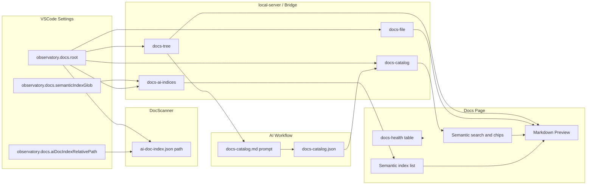

# 可配置文档目录与文档页展示（设计计划）

> **状态**：计划中（尚未全部实现）  
> **更新**：2026-04-10  
> **说明**：本文档由 Observatory「文档管理」相关讨论整理，供实现与评审使用。参考外部仓库：`cash_loan/docs`（含 `domain/repay` 下 AI 增强文档形态）。

## 概述

在 VS Code 设置中增加「文档根目录」等可选项，替换扩展内硬编码的 `docs/00-meta/ai-doc-index.json` 路径；在「文档」页增加基于该目录的知识库浏览（目录树 + Markdown 预览），并与现有 docs-health 数据并存。增加「AI 文档目录」工作流（docs-catalog）与 AI 增强文档能力，对齐 cash_loan repay：`meta/ai-index-*.json` 语义锚点索引的发现与摘要 API、`governance/` 等治理类文档的角色识别，以及可选第二提示词 `docs-semantic-index.md` 生成锚点 JSON。本地 HTTP API 与 Bridge 保证浏览器模式与 Extension 模式一致。

## 实施任务清单

- [ ] 在 `extension/package.json` 增加 `observatory.docs.root` 与 `observatory.docs.aiDocIndexRelativePath`，并实现配置解析辅助函数
- [ ] DocScanner 使用可配置路径读取 ai-doc-index；project-scanner / doc-scan-only 贯通
- [ ] local-server 增加 docs-config、docs-tree、docs-file，文档根下 safeUnderRoot 校验
- [ ] observatory-request-handler + CursorBridgeDataSource 对齐 HTTP 能力；可选 workspace.openFile
- [ ] 增加 docs-catalog 提示词模板（templateDir 可覆盖）、内置 JSON Schema 说明；可选命令「复制文档目录整理提示词」并注入 docs-tree 路径列表（或分块策略说明）
- [ ] 约定 docs-catalog.json 路径（相对文档根，如 `00-meta/docs-catalog.json`）与 TypeScript 类型；提供读取 API/Bridge；支持用户将 AI 输出保存后由面板加载
- [ ] DocsHealth 页：目录树 + react-markdown 预览 + 保留健康度区块；集成「文档目录」搜索（模糊匹配 title/summary/tags/path）与分类筛选；大仓库列表限制/搜索
- [ ] 文档根下 glob 发现 `meta/ai-index-*.json`（可配置 glob），聚合为摘要 API；面板展示锚点数量、跳转关联流程 MD/JSON；路径规则识别 governance 类文档
- [ ] 可选第二模板 `docs-semantic-index.md`（参考 repay meta JSON 的 domain/flow/anchors 结构），用于 AI 生成或增量补全语义锚点索引

---

## 背景与参考

- **cash_loan/docs** 的典型结构：根级 `index.md` 作为**知识库门户**（分类表格 + 相对路径链接），其下按 `standards/`、`domain/`、`playbooks/`、`faq/` 等分层；部分子域还有 `meta/ai-index-*.json`。这是「可浏览 + 可检索」的文档产品形态。
- **cash_loan `domain/repay` 的 AI 增强分层（本计划要对齐的能力）**
  - **语义锚点机器索引**：`meta/ai-index-repay-*.json`，含 `domain`、`flow`、`documentation`（指向流程/状态机 Markdown）、`anchors[]`（`id`、`description`、`class`、`module`、`docSection`、`methods`）。流程正文通过文字引用回链到「完整锚点定义见 meta JSON」。
  - **治理与评测 Markdown**：`governance/index.md` 汇总 **A/B 理解基线**（`ai-understanding-baseline-*.md`）、**Phase 偏差记录**（`ai-review-*.md`）、专项治理清单等 —— 与「流程文档」并列，需在面板中可按 **文档角色**（流程 / 治理 / 路线图）筛选或打标签。
  - **入口索引**：`repay/index.md` 链到 AI 试点方案、工具指南、治理索引 —— 与全局 `docs-catalog` 互补：catalog 偏「人类检索」，meta JSON 偏「代码/锚点/Agent 对齐」。
- **当前实现**：`extension/src/scanners/doc-scanner.ts` 将 `ai-doc-index.json` **写死**为 `docs/00-meta/ai-doc-index.json`；`webview-ui/src/views/DocsHealth.tsx` 只展示**健康度分数与检查表**，无法在面板内阅读文档，也**未消费**多文件 `ai-index-*.json` 与治理类文档结构。

## 建议（产品/交互）

| 方向 | 说明 |
|------|------|
| **单一「文档根」配置** | 默认 `docs`（相对工作区根）。扫描与浏览都以此为锚，与 cash_loan 的「整棵知识树挂在 `docs/` 下」一致。 |
| **门户页优先** | 若存在 `{docsRoot}/index.md`，默认打开它作为首页（与 cash_loan 一致）；无则展示目录树第一项或空状态引导。 |
| **双区块并存** | 上方或 Tab：**文档浏览**（树 + 预览）；**健康度**（现有 `docs-health` 表格）。避免健康度与阅读场景割裂。 |
| **预览技术栈** | 项目已具备 `react-markdown`、`remark-gfm`、`mermaid`——预览 Markdown 时优先 GFM，图表按需再接 mermaid（可二期）。 |
| **相对链接** | 预览区内 `](./foo.md)` 应解析为「相对当前文件、且不得越出文档根」的路径（与安全校验一致）。 |
| **打开编辑器** | 在 Extension 宿主环境下增加 bridge 方法（如 `openWorkspaceFile`），用 `vscode.Uri.file` + `vscode.window.showTextDocument`，便于从面板跳到源文件编辑。 |
| **二期（可选）** | `docs/SCHEMA_SPEC.md` 中已描述但 `doc-scanner.ts` 未完全实现的 `primary_doc_validity` 等检查；与多文件 meta 聚合结果交叉校验。 |
| **AI 文档目录 + 快速检索** | 见下文「§ AI 整理提示词与 docs-catalog 产物」：用提示词让 AI 对文档路径/标题做**用途说明、分类、标签**，输出**固定 JSON**；面板加载该 JSON 后提供**搜索框 + 分类 chip + 点击跳转预览**，与目录树互补（树按路径，目录按语义）。 |
| **AI 增强文档（对齐 repay）** | 见下文「§ AI 增强：语义锚点与治理类文档」：**发现**文档根下 `meta/ai-index-*.json`、在 UI 展示锚点统计与「关联流程/JSON」快捷打开；`docs-catalog` 条目可带 **`doc_kind`**（如 `flow`、`governance_baseline`、`governance_review`、`roadmap`、`meta_index`）以便筛选；可选第二提示词生成 **repay 风格 anchors JSON**。 |

## AI 整理提示词与 docs-catalog 产物

**目标**：不强制在扩展内调用大模型 API（避免密钥与供应商绑定）；采用与现有 SDD 一致的 **「生成提示词 → 用户在 Cursor/Agent 中执行 → 将结构化结果保存为仓库内 JSON」** 模式（参考 `extension/src/observatory/prompt-template-loader.ts`、`webview-ui/src/lib/prompt-generators.ts` 的思路）。

**产物文件（建议）**

- 路径：`{docsRoot}/00-meta/docs-catalog.json`（与 `ai-doc-index.json` 同层，便于治理）。
- **与现有 `ai-doc-index.json` 能力条目**（`extension/src/scanners/adapters/ai-doc-index-adapter.ts`）区分：`ai-doc-index`（Observatory 根目录元数据）侧重 **能力 ID / 代码 hints**；`docs-catalog` 侧重 **知识库导航**（每篇文档「讲什么」、归哪一类、搜什么词能命中）。**repay 式** `meta/ai-index-*.json` 侧重 **语义锚点 / 类与方法对齐**，由 **`docs-ai-indices` API** 单独聚合展示。三者可并存。

**建议 JSON 形状（实现时落 JSON Schema + TS 类型）**

```json
{
  "schema_version": "1.0.0",
  "generated_at": "2026-04-10T12:00:00.000Z",
  "docs_root": "docs",
  "taxonomy": [
    { "id": "playbooks", "label": "操作手册" },
    { "id": "domain", "label": "业务领域" }
  ],
  "entries": [
    {
      "path": "playbooks/release.md",
      "title": "版本发布指南",
      "summary": "发布流程、检查项与回滚要点",
      "category_id": "playbooks",
      "doc_kind": "playbook",
      "tags": ["发布", "运维", "checklist"],
      "audience": ["开发", "SRE"]
    }
  ]
}
```

**提示词内容要点（写入模板 `docs-catalog.md` 或等价命名）**

1. 输入段：由扩展或用户粘贴 **`docs-tree` 生成的相对路径列表**（仅路径即可；超大仓库可分多次「分批整理」或先只列 `index.md` 与各目录 `index.md`）。
2. 任务：通读路径语义（必要时用户补充「已附上的摘要片段」——二期可由扩展自动注入每文件前 2KB 文本）、为每条生成 **summary（1～2 句）**、**category_id**（来自 taxonomy 或允许新增）、**tags（5 个以内）**。
3. 输出：**仅一个** ` ```json ` 代码块，严格符合约定 schema，便于用户「保存为 `docs-catalog.json`」。
4. 维护说明：当文档增删时，可再次运行同一流程 **全量覆盖** 或提示词要求 **merge 策略**（二期）。

**面板侧能力**

- **加载**：若存在 `docs-catalog.json`，文档页顶部展示 **全局搜索**（对 `title`、`summary`、`tags`、`path` 做不区分大小写的子串或简单分词匹配；体量大时可仅前端过滤）。
- **分类**：`taxonomy` / `category_id` 映射为 **可点击筛选**（chip），与搜索组合使用。
- **跳转**：选中条目 → 右侧打开对应 `docs-file` 预览；若安装了扩展，保留「在编辑器中打开」。

**可选增强（三期）**

- 命令 **Import docs catalog**：剪贴板 JSON 校验后写入 `00-meta/docs-catalog.json`。
- `doc-scanner` 增加轻量检查：`entries[].path` 是否均在文档根下真实存在（与 docs-health 联动）。

## AI 增强：语义锚点与治理类文档（参照 cash_loan repay）

**与 `docs-catalog` 的分工**

| 层级 | 典型产物 | 用途 |
|------|----------|------|
| **导航层** | `docs-catalog.json` | 人读：摘要、标签、分类、快速搜 |
| **机器锚点层** | `meta/ai-index-*.json`（可多文件） | Agent/IDE：锚点 ID ↔ 类/方法/文档章节；与 Observability 能力 ID 体系可并行 |
| **治理层** | `governance/ai-understanding-baseline-*.md`、`ai-review-*.md` | 质量与演进记录；面板侧作为 **doc_kind** 与路径模式识别即可 |

**配置（建议）**

- **`observatory.docs.semanticIndexGlob`**：默认 `"**/meta/ai-index*.json"`，根为「文档根目录」（即相对于 `observatory.docs.root`），用于 **glob 扫描**（避免只认单一路径）。若某仓库锚点放在 `00-meta/` 单文件，可改为更窄 glob 或保留单文件读取逻辑。

**API**

- **`GET /api/workspace/docs-ai-indices`**（命名可调整）：在文档根下按 glob 列出所有语义索引文件，返回轻量摘要数组，例如：`{ "relativePath": "domain/repay/meta/ai-index-repay-callback.json", "domain": "repay", "flow": "callback", "anchorCount": 12, "docLinks": ["flows/repay-callback-flow.md"] }`（具体字段以解析 JSON 的 `version`/`domain`/`flow`/`documentation`/`anchors.length` 为准）。**不**在接口中返回完整 anchors 大对象，避免 payload 过大；需要时在面板内请求 **单文件** `docs-file` 读取 JSON（或专用 `docs-ai-index-file`）。

**UI**

- 文档页增加 **「语义索引」** 子区（或 Tab）：表格/列表展示各 `ai-index-*.json`、锚点数量、跳转打开流程 MD / 元数据 JSON。
- 目录树节点：若某目录存在 meta JSON，显示 **角标**（如锚点数或「AI」）。
- 搜索：在 `docs-catalog` 的 `tags` / `doc_kind` 中纳入 **governance**、**baseline** 等（可由 AI 在生成 catalog 时按路径启发式 + 人工修正）。

**提示词（第二模板，可选）**

- 文件名建议：`docs-semantic-index.md`（由 `templateDir` 覆盖）。
- 输入：指定 `flow`/`domain`、相关源码路径、已有流程 Markdown 大纲；输出：与 repay 一致的 **`anchors` 数组** JSON（或整文件包装 `version`/`documentation`），便于落盘为 `meta/ai-index-<domain>-<flow>.json`。
- 与第一模板 `docs-catalog.md` **分离开**：避免单提示词过长、职责混杂。

## 技术方案概要

### 1. 配置项（`extension/package.json` `contributes.configuration`）

- **`observatory.docs.root`**：`string`，默认 `"docs"`，描述为「相对工作区根目录的文档根目录」。
- **（推荐）`observatory.docs.aiDocIndexRelativePath`**：`string`，默认 `"00-meta/ai-doc-index.json"`，描述为「相对文档根的 AI 文档索引路径」。  
  - 解析为：`path.join(workspaceRoot, docsRoot, aiDocIndexRelativePath)`。  
  - 这样 cash_loan 若将索引放在其他相对位置，只需改此项而无需改代码。
- **`observatory.docs.semanticIndexGlob`**：`string`，默认 `"**/meta/ai-index*.json"`，描述为「相对文档根、用于发现 repay 式语义锚点 JSON 的 glob」；详见上文「§ AI 增强」。

读取方式与现有设置一致：在扩展侧用 `vscode.workspace.getConfiguration("observatory", vscode.Uri.file(workspaceRoot))`（参考 `extension/src/bridge/observatory-request-handler.ts` 中对 `getConfiguration` 的用法）。

### 2. 扫描层

- 在 `DocScanner`（`extension/src/scanners/doc-scanner.ts`）中注入上述配置（通过参数传入或从 `getConfiguration` 读取 `workspaceRoot` 对应配置），**替换**硬编码的 `docs/00-meta/ai-doc-index.json`。
- `project-scanner.ts` / `doc-scan-only.ts` 调用处传入同一逻辑，保证全量扫描与轻量刷新一致。

### 3. 本地 HTTP API（浏览器仪表盘同源）

在 `extension/src/server/local-server.ts` 中已有 `safeUnderRoot`、`pickRoot`、注册 store 等模式；新增例如：

- **`GET /api/workspace/docs-config`**：返回 `{ docsRoot, aiDocIndexRelativePath, semanticIndexGlob }`（从配置读取，供 UI 展示「当前文档根」与索引 glob）。
- **`GET /api/workspace/docs-tree`**：在 `path.join(workspaceRoot, docsRoot)` 下递归列出 `*.md`（可限制深度、忽略 `node_modules` 等，与 `extension/src/scanners/scan-ignores.ts` 对齐思路）。
- **`GET /api/workspace/docs-file?relativePath=...`**：读取单个文件 UTF-8 内容。  
  **安全**：解析 `relativePath` 后 `path.join(docsRootAbs, relativePath)`，并用 **`safeUnderRoot(docsRootAbs, candidate)`**（与现有 `safeUnderRoot(workspaceRoot, fp)` 同构，根改为文档根）防止路径穿越。
- **`GET /api/workspace/docs-catalog`**：若存在 `{docsRoot}/00-meta/docs-catalog.json` 则返回解析后的 JSON，否则返回 404 或 `{ "entries": [] }`（产品决策二选一，建议 404 + UI 空状态引导生成）。
- **`GET /api/workspace/docs-ai-indices`**：见上文「§ AI 增强」，返回文档根下各 `ai-index*.json` 的摘要列表（实现时注意 glob 性能与数量上限）。

### 4. Webview 数据层

- `webview-ui/src/services/http-client.ts`：为上述 API 增加方法。
- `webview-ui/src/services/cursor-bridge.ts` + `extension/src/bridge/observatory-request-handler.ts`：实现同等 `method`（如 `docs.listTree`、`docs.readFile`、`docs.getConfig`、`docs.getCatalog`、`docs.listAiIndices`、`workspace.openFile`），保证嵌入 Webview 时不走 HTTP 或走同源封装均可（与现有 bridge 风格一致）。

### 5. UI（`webview-ui/src/views/DocsHealth.tsx` 或拆分为子组件）

- 布局：**左侧**可折叠目录树 + 路径级搜索过滤；**中栏（可选）** 或 **顶部**：`docs-catalog` **语义搜索 + 分类筛选**（无 catalog 时显示引导：复制提示词、生成 JSON）；**「语义索引」区**展示 `docs-ai-indices` 摘要；**右侧** Markdown 预览（`react-markdown` + `remark-gfm`）；可选第四栏/抽屉展示选中 JSON 的格式化视图（仅小文件或截断）。
- 默认选中 `{docsRoot}/index.md`（若树接口返回存在）。
- 顶部或 Tab：**健康度**区块保持现有 `DocsCheckTable` 逻辑不变。
- 若存在「在编辑器中打开」按钮，仅在 `acquireVsCodeApi` 可用时显示。



## 风险与注意

- **大仓库**：文档树接口需限制文件数量或分页，避免一次返回数万节点。
- **浏览器模式**：仅扩展注册的 workspace 可读（已有 `getStore` 校验），与现有 Observatory API 一致。

## 主要改动文件（实现阶段）

- `extension/package.json` — 新配置项；可选新命令「复制文档目录整理提示词」
- `extension/src/scanners/doc-scanner.ts` — 可配置索引路径
- `extension/src/observatory/prompt-template-loader.ts` — 扩展加载 `docs-catalog.md`、`docs-semantic-index.md`
- `extension/src/server/local-server.ts` — docs tree/file/docs-catalog / docs-ai-indices API
- `extension/src/bridge/observatory-request-handler.ts` — bridge 方法（含 `docs.getCatalog`、提示词片段可选）
- `webview-ui/src/services/http-client.ts`、`webview-ui/src/services/cursor-bridge.ts` — 数据源
- `webview-ui/src/types/observatory.ts` — `DocsCatalog` 类型（若放在 observatory 类型层）
- `webview-ui/src/views/DocsHealth.tsx`（及可能拆出的 `components/docs/*`）— 浏览 + **语义搜索** + 预览 UI
- （可选）`schemas/docs-catalog.schema.json` — JSON Schema，便于校验导入
