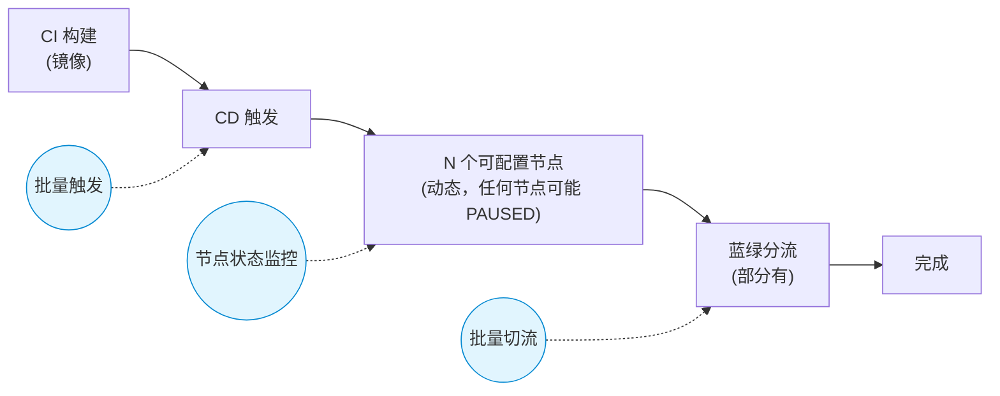
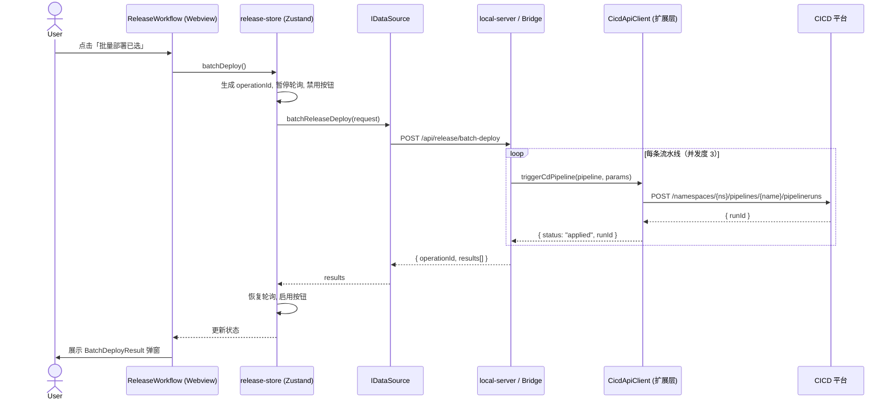
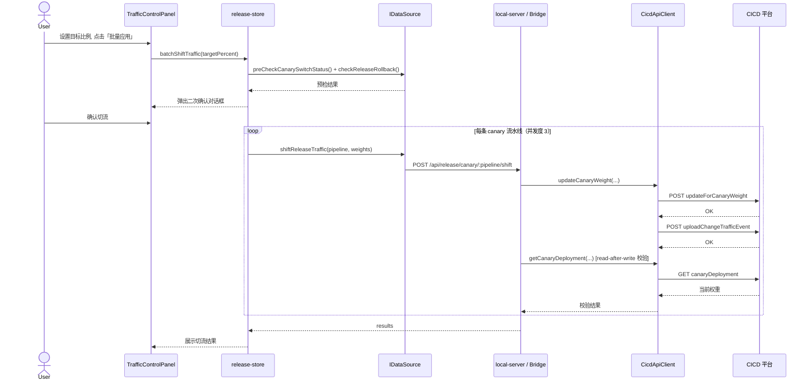

# 生产发布流程面板设计方案

> 版本: 1.4  
> 日期: 2026-04-09  
> 状态: 初稿（v1.4 新增术语表、Scope 边界、取消机制、部署顺序、Dry-Run、权重校验、类型统一等优化）

## 相关文档

| 文档 | 关系 |
|------|------|
| [REQUIREMENT_PANEL_V2_DESIGN.md](REQUIREMENT_PANEL_V2_DESIGN.md) | 需求面板 V2（含环境部署卡片，为测试/泳道部署） |
| [EXTENSION_DESIGN.md](EXTENSION_DESIGN.md) | 扩展架构与本地服务端设计 |
| [FRONTEND_DESIGN.md](FRONTEND_DESIGN.md) | 前端组件结构与 IDataSource 接口 |
| [ARCHITECTURE.md](ARCHITECTURE.md) | 数据流与通信架构 |

## 术语表

| 术语 | CICD 平台含义 | 本文中的配置项 | 示例值 |
|------|-------------|-------------|--------|
| namespace | DevOps 项目标识，流水线和镜像的归属空间 | `devopsProject` | `cash-loanjqjjq` |
| workspace | 工作空间，蓝绿分流等跨项目能力的归属 | `workspace` | `cashloan` |
| cluster | 部署目标集群/环境 | `cluster` | `prod` |
| project | 业务项目名，用于发布单和审计 | `project` | `cash-loan` |
| moduleName | 服务模块短名，用于镜像查找和切流事件 | — | `cash-loan-channel-api` |
| fullModuleName | 服务模块全限定名（含命名空间前缀），用于 CD 触发参数 | — | `cn-cashloan-cash-loan-channel-api` |
| repoName | 镜像仓库名，用于查询可用镜像 tag | — | `cash-loan-channel-api` |
| deploymentName | Kubernetes Deployment 名称，用于蓝绿分流 | — | `java-cash-loan-channel-api` |
| pipelineType | 流水线类型，决定是否有蓝绿分流阶段 | — | `canary` / `prod` |

---

## 一、背景与目标

### 1.1 问题

生产发布流程涉及多个服务（API、Service、Scheduler 等），每次发布需要：

1. 在 CICD 平台逐个点击每条流水线的「运行」按钮
2. 在每条流水线中逐一确认各个节点（上线单确认、灰度确认、分流确认等）
3. 在蓝绿分流页面逐个调整每条流水线的新老版本流量比例

**当前痛点**：无法批量操作，10+ 条流水线需要重复操作几十次，耗时且容易遗漏。

### 1.2 目标

新增一个「生产发布」面板，核心能力：

1. **一键批量触发 CD** — 选择镜像后，批量向多条流水线下发部署指令
2. **流水线状态全景监控** — 实时展示所有流水线当前所处节点及等待状态
3. **批量蓝绿切流** — 选择多条流水线后，统一调整新老版本流量比例

### 1.3 Scope 边界（不做什么）

明确以下内容**不在本方案 Scope 内**：

- **不做**：流水线配置管理（由 CICD 平台负责）
- **不做**：镜像构建 / CI 阶段（面板只管 CD 及之后的流程）
- **部分支持**：对 **PAUSED 且子 step 含 input** 的节点，面板提供「继续 / 终止」（代理 `devops.kubesphere.io/v1alpha2` 的 `SubmitInputStep`，与 Console 一致）。其他审批类节点（如发布单 URL 跳转）仍以平台为准。
- **不做**：多环境支持（当前只面向 prod 环境，测试/泳道部署由 DeployCard 负责）
- **不做**：持久化操作历史（面板是无状态代理，操作日志依赖 CICD 平台自身的审计能力）
- **不做**：跨项目发布编排（当前面板仅服务于 `observatory.release.project` 所配置的单个项目）

### 1.4 设计原则

- **Token 安全**：CICD Token 仅存储在扩展环境变量中，不进入 Prompt、不落盘到项目文件
- **双数据源兼容**：与现有架构一致，同时支持 HTTP（浏览器仪表盘）和 Bridge（Webview）
- **渐进式操作**：批量操作前必须确认，关键操作（切流）有二次确认机制；批量操作支持中途取消
- **显式映射优先**：凡是涉及 `pipeline → module/repo/deployment/type` 的推断，优先使用显式配置映射，命名规则仅作兜底
- **只代理不存储**：面板只做 CICD 平台 API 的代理层，不持久化流水线运行时数据
- **Dry-Run 优先**：高危批量操作提供预检模式，让用户在实际执行前看到完整的预期结果

### 1.5 非功能性需求

| 维度 | 要求 | 说明 |
|------|------|------|
| **性能** | 面板首屏 < 3s | 打开面板到流水线列表首次渲染完成 |
| **性能** | 批量部署 10 条 < 15s | 并发度 3，单条 CD 触发 ~1.5s |
| **性能** | 镜像兼容性计算 < 100ms | 缓存 `imageIndex`，仅在镜像/流水线变化时重算 |
| **可靠性** | 部分失败不影响已成功项 | 批量操作逐条原子化，失败项不回滚已成功项 |
| **可靠性** | 操作幂等 | 同一 `pipeline + imageTag` 重复触发返回 `skipped` |
| **可观测性** | `operationId` 贯穿本地链路 | 前端生成 → 代理层日志 → 结果展示；外部审计事件通过 `pipelineRunId + timestamp` 关联 |
| **可用性** | CICD 平台不可达时优雅降级 | 连续 3 次失败暂停轮询，显示"不可达"横幅 |
| **安全性** | Token 不出扩展进程边界 | 不传递给 Webview、不写入项目文件、不出现在日志中 |
| **安全性** | 本地服务需认证 | 随机 session token 防止同机其他进程调用 |
| **兼容性** | VS Code >= 1.85 | 依赖 SecretStorage API 和 Webview API |

---

## 二、生产发布流程模型

### 2.1 完整流程（概念模型）

下图为**典型**流程示意，实际每条流水线的节点链由 CICD 平台动态配置，节点数量和类型因流水线而异：



**节点链是动态的**：不同流水线可配置不同数量、不同类型的节点。常见节点类型包括但不限于：

| 节点类型 | 说明 | 是否可能 PAUSED |
|---------|------|----------------|
| 拉取代码 | 自动执行 | 否（一般自动） |
| 镜像部署 | 部署到目标集群 | 否（一般自动） |
| 发布单确认 | 检查上线发布单是否全部确认 | 是 |
| 服务启动等待 | 等待 Pod 启动完成（30-40 min） | 否（自动等待） |
| 灰度确认 | 对客服务的灰度阶段确认 | 是 |
| 自定义审批 | 项目自定义的审批节点 | 是 |
| 蓝绿分流确认 | 确认结束分流 | 是 |
| 清理 / 收尾 | 清理旧版本等 | 否（一般自动） |

**关键约束**：面板不硬编码节点类型，而是从 CICD 平台 API 返回的 `nodedetails` 中动态读取每个节点的 `displayName` 和 `status`，按实际顺序渲染。

### 2.2 流水线类型

| 类型 | 是否有蓝绿分流 | 典型服务 |
|------|---------------|---------|
| API（对客） | 是（canary） | cash-loan-channel-api, cash-loan-api |
| Service（对客） | 是（canary） | cash-loan-service |
| Scheduler（内部） | 否（直接发布） | cash-loan-funding-scheduler |
| 其他内部服务 | 否 | 各类 worker、consumer |

### 2.3 节点状态模型

每条流水线由**不定数量**的 node 组成（从 `nodedetails` API 动态获取），每个 node 有以下状态：

```typescript
type NodeStatus =
  | "SUCCESS"        // 已完成
  | "IN_PROGRESS"    // 运行中
  | "PAUSED"         // 等待确认（需要人工操作——可出现在任意节点）
  | "NOT_BUILT"      // 未到达
  | "FAILED"         // 失败
  | "ABORTED";       // 已中止
```

**PAUSED 节点的通用处理**：面板不假设哪个节点会 PAUSED，而是对所有 `status === "PAUSED"` 的节点统一高亮提示，展示该节点的 `displayName` 作为操作说明。

### 2.4 流水线阶段摘要模型

为了满足“**所有流水线当前进行到哪一步**”的核心诉求，除了单条流水线的完整 `nodedetails` 外，还需要为列表页维护一份轻量级的阶段摘要。

```typescript
type PipelineStageType =
  | "idle"
  | "deploying"
  | "waiting_release"
  | "waiting_gray_confirm"
  | "waiting_bluegreen_switch"
  | "waiting_manual"
  | "succeeded"
  | "failed"
  | "aborted"
  | "unknown";

interface ReleaseOrderSummary {
  status: "pending" | "partial" | "approved" | "unknown";
  confirmedCount?: number;
  totalCount?: number;
  url?: string;
}

interface ManualActionInfo {
  kind: "release-order" | "gray-confirm" | "manual-approval" | "bluegreen-confirm" | "custom";
  title: string;
  description?: string;
  externalUrl?: string;
}

interface PipelineStageSummary {
  pipelineName: string;
  runId?: string;
  stageType: PipelineStageType;
  stageLabel: string;
  waitingReason?: string;
  currentNodeName?: string;
  requiresManualAction: boolean;
  action?: ManualActionInfo;
  releaseOrder?: ReleaseOrderSummary;
  updatedAt: string;
}
```

**设计约束**：

- 列表页默认展示 `PipelineStageSummary`，避免为了“阶段总览”对每条流水线都实时拉取完整 `nodedetails`
- 仅当用户点开某条流水线时，再加载其完整节点链到 `PipelineNodeTimeline`
- `PipelineStageSummary` 由扩展层聚合生成，前端不直接基于多个原始接口拼装业务阶段

**阶段推断规则**：

虽然面板不硬编码节点类型，但 `PipelineStageType` 中包含 `waiting_release`、`waiting_gray_confirm`、`waiting_bluegreen_switch` 等语义化阶段。扩展层需要从 `nodedetails` 的 `displayName` 推断出这些阶段，推断逻辑集中在扩展层，规则可配置：

```typescript
interface StageInferenceRule {
  pattern: string;            // 正则表达式字符串，匹配 displayName
  stageType: PipelineStageType;
  actionKind: ManualActionInfo['kind'];
}

const DEFAULT_STAGE_INFERENCE_RULES: StageInferenceRule[] = [
  { pattern: "发布单|release.?order", stageType: "waiting_release", actionKind: "release-order" },
  { pattern: "灰度|gray|canary.?confirm", stageType: "waiting_gray_confirm", actionKind: "gray-confirm" },
  { pattern: "蓝绿|blue.?green", stageType: "waiting_bluegreen_switch", actionKind: "bluegreen-confirm" },
  { pattern: "审批|approv", stageType: "waiting_manual", actionKind: "manual-approval" },
];
```

- 匹配不到任何规则时，统一归为 `waiting_manual` + `kind: "custom"`
- 规则可通过配置项 `observatory.release.stageInferenceRules` 覆盖
- 推断结果缓存在 `PipelineStageSummary` 中，前端不参与推断逻辑
- 列表排序、筛选和按钮置灰逻辑应优先依赖拆分后的阶段，而不是笼统的 `waiting_canary`

---

## 三、架构设计

### 3.1 总体架构

```
┌─ 环境变量（安全层）────────────────────────────────────┐
│  CICD_TOKEN         — CICD 平台认证 Cookie/Token       │
│  CICD_BASE_URL      — CICD 平台地址（默认值可内置）      │
│  CICD_DEVOPS_PROJECT — DevOps 项目标识                  │
│  CICD_WORKSPACE      — 工作区标识                       │
│  CICD_OPERATOR       — 操作人标识                       │
│  ↑ 可通过「从 curl 导入」自动填充（见第十六章）          │
└───────────────────────────────────────────────────────┘
         │
         ▼
┌─ 扩展代理层 ──────────────────────────────────────────┐
│  extension/src/release/                               │
│  ├── cicd-api-client.ts   — CICD 平台 HTTP 客户端      │
│  ├── release-types.ts     — 类型定义                   │
│  ├── release-handler.ts   — Bridge/HTTP 请求处理       │
│  └── curl-parser.ts       — curl 命令解析 → 自动提取配置│
└───────────────────────────────────────────────────────┘
         │
         ▼
┌─ 本地服务层 ──────────────────────────────────────────┐
│  local-server.ts  → /api/release/* 路由               │
│  observatory-request-handler.ts → release.* 方法       │
└───────────────────────────────────────────────────────┘
         │
         ▼
┌─ 前端展示层 ──────────────────────────────────────────┐
│  views/ReleaseWorkflow.tsx — 主视图                    │
│  components/release/                                  │
│  ├── PipelineTable.tsx      — 流水线列表/状态表格       │
│  ├── BatchDeployDialog.tsx  — 批量部署确认弹窗          │
│  ├── TrafficControlPanel.tsx — 蓝绿切流控制面板         │
│  ├── PipelineNodeTimeline.tsx — 单条流水线节点时间线     │
│  └── ImageSelector.tsx      — 镜像版本选择器            │
└───────────────────────────────────────────────────────┘
```

### 3.2 数据流

```
CICD 平台 API
    ↑ ↓ (HTTPS, 带 Token)
扩展代理层 (cicd-api-client.ts)
    ↑ ↓
本地服务层 (local-server.ts / bridge)
    ↑ ↓ (HTTP / postMessage)
前端 UI 层 (ReleaseWorkflow.tsx)
```

关键决策：**扩展侧做 API 代理**，原因：
- CICD Token 不能暴露给浏览器前端
- 浏览器直接请求 CICD 平台存在跨域问题
- 保持与现有 observatory 架构一致的数据源模式

### 3.3 端到端时序图（批量部署）



### 3.4 端到端时序图（批量切流）



### 3.5 与现有 DeployCard 的关系

| 维度 | DeployCard（需求面板 V2） | ReleaseWorkflow（本方案） |
|------|-------------------------|--------------------------|
| 用途 | 开发泳道部署（测试环境） | 生产发布（prod 环境） |
| 操作粒度 | 单次部署 | 批量多流水线 |
| 数据持久化 | observatory-sdd.json | 无持久化（实时代理） |
| MCP 依赖 | cicd-feature-branch MCP | 直接 HTTP 代理到 CICD 平台 |

两者互不干扰，场景完全独立。

---

## 四、环境变量配置

### 4.1 扩展配置项

在 `extension/package.json` → `configuration.properties` 中新增：

```json
"observatory.release.cicdBaseUrl": {
  "type": "string",
  "default": "https://cicd.fintopia.tech",
  "description": "CICD 平台 Base URL"
},
"observatory.release.devopsProject": {
  "type": "string",
  "default": "cash-loanjqjjq",
  "description": "CICD DevOps 项目标识（namespace）"
},
"observatory.release.workspace": {
  "type": "string",
  "default": "cashloan",
  "description": "CICD 工作区标识"
},
"observatory.release.cluster": {
  "type": "string",
  "default": "prod",
  "description": "部署目标集群"
},
"observatory.release.project": {
  "type": "string",
  "default": "cash-loan",
  "description": "项目名，用于查询镜像和发布单"
},
"observatory.release.operator": {
  "type": "string",
  "default": "",
  "description": "操作人标识，用于切流事件上报"
},
"observatory.release.pipelineFilter": {
  "type": "string",
  "default": "prod",
  "description": "流水线名称过滤关键词"
}
```

建议在文档中同步维护一张**配置总表**，避免设计章节新增配置后漏回填到这里：

| 配置项 | 类型 | 默认值 | 用途 |
|------|------|--------|------|
| `observatory.release.cicdBaseUrl` | string | `https://cicd.fintopia.tech` | CICD 平台地址 |
| `observatory.release.devopsProject` | string | `cash-loanjqjjq` | DevOps namespace |
| `observatory.release.workspace` | string | `cashloan` | workspace |
| `observatory.release.cluster` | string | `prod` | 目标环境 |
| `observatory.release.project` | string | `cash-loan` | 发布单/切流关联项目 |
| `observatory.release.operator` | string | `""` | 审计事件操作人 |
| `observatory.release.pipelineFilter` | string | `prod` | 流水线筛选关键词 |
| `observatory.release.autoPolling` | boolean | `true` | 是否启用自动轮询 |
| `observatory.release.batchConcurrency` | number | `3` | 批量部署/切流并发度 |
| `observatory.release.notifications` | enum | `all` | VS Code 通知级别 |
| `observatory.release.stageInferenceRules` | array | 内置默认规则 | 节点名到阶段类型的推断规则 |
| `observatory.release.pipelineMetadataMap` | object | `{}` | `pipeline → module/fullModule/repo/type/deploymentName/deployOrder` 统一显式映射（详见附录 D） |

### 4.2 敏感凭据（环境变量）

以下凭据通过 VS Code 扩展的 **SecretStorage API** 或环境变量提供，不写入 settings.json：

| 环境变量 / Secret | 说明 | 获取方式 |
|-------------------|------|---------|
| `CICD_TOKEN` | CICD 平台认证 Cookie（完整 Cookie 串） | 从浏览器 DevTools 复制 |

用户首次使用时，面板顶部显示「配置向导」，引导用户：
1. 打开 CICD 平台并登录
2. 从浏览器 DevTools → Application → Cookies 复制关键 Cookie
3. 运行命令 `Observatory: Set CICD Token` 写入 SecretStorage

### 4.3 配置校验

扩展启动时执行环境校验，返回结构化状态：

```typescript
interface ReleaseEnvStatus {
  configured: boolean;
  tokenSet: boolean;
  tokenValid: boolean;           // Token 主动健康检查结果
  baseUrlValid: boolean;
  devopsProject: string;
  workspace: string;
  cluster: string;
  project: string;
  operator: string;
  issues: string[];              // 配置问题列表
  lastTokenCheckAt?: string;     // 上次 Token 校验时间
}
```

### 4.4 Token 主动健康检查

被动检测（401/302 响应）只能在用户操作时才发现过期，体验差。增加主动健康检查机制：

**触发时机**：
- 面板打开时（首次加载数据前）
- 从后台切回面板时（距上次检查 > 5 分钟）
- 用户手动点击「检查连接」按钮

**检查方式**：
- 调用 `listPipelines(filter, page=1, limit=1)` 作为轻量探针
- 若返回 401 / 302 / 403 → `tokenValid = false`，显示"Token 已过期，请重新配置"
- 若网络不可达 → 区分为"网络错误"而非"Token 过期"

**前端行为**：
- Token 无效时，所有操作按钮禁用，顶部显示醒目的红色横幅
- 提供快捷入口：「重新配置 Token」→ 直接跳转到 SecretStorage 设置或 curl 导入

---

## 五、CICD 平台 API 抽象

### 5.1 API 端点映射

从用户提供的 curl 命令中抽象出以下 API：

| 能力 | HTTP 方法 | 路径 | workspace 来源 | 说明 |
|------|----------|------|--------------|------|
| 获取流水线列表 | GET | `/kapis/devops.kubesphere.io/v1alpha3/devops/{namespace}/pipelines` | — | 支持分页、过滤、排序 |
| 获取流水线运行节点详情 | GET | `/kapis/devops.kubesphere.io/v1alpha3/namespaces/{namespace}/pipelineruns/{runId}/nodedetails` | — | 返回节点列表及状态 |
| 获取可用镜像列表 | GET | `/kapis/cicd.kubesphere.io/v1alpha4/namespaces/{namespace}/image/tags` | — | 按 repoName + env 过滤 |
| 查询发布单信息 | POST | `https://aone-extra.fintopia.tech/api/v1/releaseOrder/queryByParams` | — | 跨域到 aone-extra |
| 触发 CD 流水线 | POST | `/kapis/devops.kubesphere.io/v1alpha3/namespaces/{namespace}/pipelines/{pipelineName}/pipelineruns` | — | 携带参数列表 |
| 获取蓝绿部署信息 | GET | `/kapis/cicd.kubesphere.io/v1alpha4/workspaces/{workspace}/canary-deploy/canaryDeployment` | 配置项 | namespace + name + cluster |
| 调整蓝绿流量比例 | POST | `/kapis/cicd.kubesphere.io/v1alpha4/workspaces/{workspace}/canary-deploy/updateForCanaryWeight` | 配置项 | 设置新老版本权重 |
| 上报切流事件 | POST | `/kapis/cicd.kubesphere.io/v1alpha4/workspaces/default/bluegreen/uploadChangeTrafficEvent` | **硬编码 `default`** | 审计日志 |
| 查询切流日志 | GET | `/kapis/cicd.kubesphere.io/v1alpha4/workspaces/default/bluegreen/log` | **硬编码 `default`** | pipeline + env 过滤 |
| 检查可否回滚 | GET | `https://aone-extra.fintopia.tech/api/v1/releaseOrder/checkCanRollBack` | — | project + module + env + image |
| 预检切流状态 | POST | `/kapis/cicd.kubesphere.io/v1alpha4/workspaces/{workspace}/bluegreen/preStepCanarySwitchStatus` | 配置项 | devops + pipeline + buildEnv |

> **注意**：`uploadChangeTrafficEvent` 和 `getTrafficChangeLogs` 使用的 workspace 是 **硬编码的 `default`**，而非配置项中的 `workspace`（如 `cashloan`）。这是 CICD 平台自身的 API 设计，实现时不能将配置的 workspace 传入这两个接口。

### 5.2 API Client 类型定义

```typescript
// extension/src/release/release-types.ts

/** 流水线摘要 */
export interface PipelineInfo {
  name: string;
  displayName?: string;
  /** 模块短名，用于镜像查找和切流事件上报。优先来自显式映射；缺失时才从流水线名称推断 */
  moduleName: string;
  /** 模块全限定名（含命名空间前缀），用于 CD 触发参数的 MODULE_NAME。如 cn-cashloan-cash-loan-funding-scheduler */
  fullModuleName: string;
  repoName: string;
  /** 流水线类型，优先来自显式映射 */
  pipelineType: "canary" | "prod" | "unknown";
  /** 是否有蓝绿分流阶段 */
  hasCanary: boolean;
  /** 部署顺序（可选），同 order 值并发，不同 order 按升序串行。未配置时默认 0（全并发） */
  deployOrder?: number;
  /** 最近一次运行 */
  latestRun?: PipelineRunSummary;
  /** 列表页使用的当前阶段摘要 */
  currentStage?: PipelineStageSummary;
  /** 关键映射来源：config | inferred */
  mappingSource?: "config" | "inferred";
}

/** 注意：status 使用前端展示态（小写 camelCase），与 NodeStatus（API 原始值，大写 SCREAMING_SNAKE）风格不同 */
export interface PipelineRunSummary {
  id: string;           // 如 cash-loan-channel-api-cd-canary-vkmgx
  status: "running" | "succeeded" | "failed" | "paused" | "aborted" | "unknown";
  startTime?: string;
  duration?: number;
  /** Jenkins Build ID（切流事件需要） */
  jenkinsBuildId?: string;
}

/** 流水线运行中的节点（从 nodedetails API 动态获取，不预设节点类型） */
export interface PipelineNode {
  id: string;
  /** API 返回的节点展示名称（如"发布单确认"、"灰度验证"等，因流水线配置而异） */
  displayName: string;
  status: NodeStatus;
  /** API 返回的原始节点类型标识（stage / parallel / step 等，仅用于布局） */
  rawType?: string;
  startTime?: string;
  duration?: number;
  /** 节点在整条链中的序号（从 0 开始） */
  index: number;
  /** 对于 PAUSED 节点：等待原因或操作描述（从 API 响应中提取，若无则展示 displayName） */
  pauseDescription?: string;
  /** 该节点是否需要用户在 CICD 平台上手动操作（status === "PAUSED"） */
  requiresAction: boolean;
}

export type PipelineStageType =
  | "idle"
  | "deploying"
  | "waiting_release"
  | "waiting_gray_confirm"
  | "waiting_bluegreen_switch"
  | "waiting_manual"
  | "succeeded"
  | "failed"
  | "aborted"
  | "unknown";

export interface ReleaseOrderSummary {
  status: "pending" | "partial" | "approved" | "unknown";
  confirmedCount?: number;
  totalCount?: number;
  url?: string;
}

export interface ManualActionInfo {
  kind: "release-order" | "gray-confirm" | "manual-approval" | "bluegreen-confirm" | "custom";
  title: string;
  description?: string;
  externalUrl?: string;
}

export interface PipelineStageSummary {
  pipelineName: string;
  runId?: string;
  stageType: PipelineStageType;
  stageLabel: string;
  waitingReason?: string;
  currentNodeName?: string;
  requiresManualAction: boolean;
  action?: ManualActionInfo;
  releaseOrder?: ReleaseOrderSummary;
  updatedAt: string;
}

/** API 原始值，大写 SCREAMING_SNAKE 风格。与 PipelineRunSummary.status（前端展示态，小写）需做映射转换 */
export type NodeStatus =
  | "SUCCESS"
  | "IN_PROGRESS"
  | "PAUSED"
  | "NOT_BUILT"
  | "FAILED"
  | "ABORTED";

/** 切流权重校验工具 */
export function validateTrafficWeights(weights: Record<string, number>): void {
  const sum = Object.values(weights).reduce((a, b) => a + b, 0);
  if (sum !== 100) {
    throw new Error(`权重之和必须为 100，当前为 ${sum}`);
  }
  if (Object.values(weights).some(w => w < 0 || w > 100)) {
    throw new Error("权重值必须在 0-100 之间");
  }
  if (Object.keys(weights).length < 2) {
    throw new Error("至少需要两个版本的权重");
  }
}

/** 镜像版本 */
export interface ImageTag {
  tag: string;
  createdAt?: string;
  /** 从 tag 解析的信息 */
  parsed?: {
    branch: string;
    buildNumber: string;
    commitShort: string;
    buildTime: string;
  };
}

/** 蓝绿部署状态 */
export interface CanaryDeployment {
  namespace: string;
  name: string;            // 如 java-cash-loan-channel-api
  cluster: string;
  /** 版本 → 权重 */
  weights: Record<string, number>;
  /** 蓝版本（旧） */
  blueVersion: string;
  /** 绿版本（新） */
  greenVersion: string;
  blueWeight: number;
  greenWeight: number;
}

/** 切流日志条目 */
export interface TrafficChangeLog {
  pipeline: string;
  operator: string;
  blueVersion: string;
  greenVersion: string;
  beforeBlue: number;
  beforeGreen: number;
  afterBlue: number;
  afterGreen: number;
  timestamp: string;
}

/** 批量部署请求 */
export interface BatchDeployRequest {
  operationId: string;
  /** 是否为 Dry-Run 模式（仅预检不实际触发） */
  dryRun?: boolean;
  pipelines: {
    pipelineName: string;
    /** CD 触发参数用的全限定模块名 */
    fullModuleName: string;
    imageTag: string;
    /** 部署顺序（可选，同值并发，不同值按升序串行） */
    deployOrder?: number;
  }[];
}

/** 批量切流请求 */
export interface BatchTrafficShiftRequest {
  operationId: string;
  shifts: {
    pipeline: string;
    namespace: string;
    deploymentName: string;
    cluster: string;
    weights: Record<string, number>;
    /** 切流事件上报所需的扩展信息 */
    meta: {
      devopsProject: string;
      module: string;
      env: string;
      blueVersion: string;
      greenVersion: string;
      pipelineRunId: string;
      jenkinsBuildId: string;
      beforeBlue: number;
      beforeGreen: number;
    };
  }[];
}

export interface BatchOperationItemResult {
  pipeline: string;
  /** applied=已实际生效；skipped=因幂等/重复请求跳过；conflicted=当前状态不允许执行；failed=未生效；cancelled=用户取消后尚未执行 */
  status: "applied" | "skipped" | "conflicted" | "failed" | "cancelled";
  runId?: string;
  message?: string;
  /** 对切流场景：审计事件失败但主操作已生效 */
  auditStatus?: "not_needed" | "succeeded" | "failed";
}

/** 发布单详情（queryReleaseOrder 返回） */
export interface ReleaseOrderDetail {
  orderId: string;
  status: "pending" | "partial" | "approved" | "rejected";
  items: { title: string; confirmed: boolean }[];
  url: string;
  createdAt?: string;
}

/** 切流预检结果（preStepCanarySwitchStatus 返回） */
export interface CanarySwitchPreCheck {
  canSwitch: boolean;
  reason?: string;
  currentStep?: string;
  blockedBy?: string;
}
```

### 5.3 API Client 实现

```typescript
// extension/src/release/cicd-api-client.ts

export class CicdApiClient {
  constructor(
    private baseUrl: string,
    private cookieToken: string,
    private defaultNamespace: string,
    private defaultWorkspace: string,
    private defaultCluster: string,
    private defaultProject: string
  ) {}

  /** 通用请求方法，注入 Cookie 认证 */
  private async request<T>(
    method: string,
    url: string,
    body?: unknown,
    extraHeaders?: Record<string, string>
  ): Promise<T>;

  // --- 流水线管理 ---
  async listPipelines(filter?: string, page?: number, limit?: number): Promise<PipelineInfo[]>;
  async getPipelineRunNodes(runId: string): Promise<PipelineNode[]>;
  async getLatestPipelineRun(pipelineName: string): Promise<PipelineRunSummary | null>;

  // --- 镜像管理 ---
  async listImageTags(repoName: string, imageFilter?: string, page?: number, limit?: number): Promise<ImageTag[]>;

  // --- 部署触发 ---
  async triggerCdPipeline(
    pipelineName: string,
    params: { projectName: string; moduleName: string; buildEnv: string; imageTag: string }
  ): Promise<{ runId: string }>;

  // --- 发布单 ---
  async queryReleaseOrder(
    module: string, env: string, image: string
  ): Promise<ReleaseOrderDetail>;

  // --- 蓝绿分流 ---
  async getCanaryDeployment(
    namespace: string, name: string, cluster: string
  ): Promise<CanaryDeployment | null>;

  async updateCanaryWeight(
    namespace: string, name: string, cluster: string,
    weights: Record<string, number>
  ): Promise<void>;

  async uploadTrafficChangeEvent(event: {
    devopsProject: string;
    pipeline: string;
    project: string;
    module: string;
    envName: string;
    blueVersion: string;
    greenVersion: string;
    pipelineRunId: string;
    blueValue: number;
    greenValue: number;
    beforeBlueValue: number;
    beforeGreenValue: number;
    jenkinsBuildId: string;
    operator: string;
  }): Promise<void>;

  async getTrafficChangeLogs(
    pipeline: string, env: string, page?: number, limit?: number
  ): Promise<TrafficChangeLog[]>;

  async checkCanRollback(
    module: string, env: string, image: string
  ): Promise<{ canRollback: boolean; reason?: string }>;

  async preCheckCanarySwitchStatus(
    devops: string, pipeline: string, buildEnv: string
  ): Promise<CanarySwitchPreCheck>;
}
```

### 5.4 请求配置

API Client 需要统一的超时、重试和并发控制策略：

```typescript
interface CicdRequestConfig {
  timeoutMs: number;                // 默认 30_000，长操作（triggerCd）可设 60_000
  retries: number;                  // 仅对 GET 幂等请求自动重试，默认 2
  retryDelayMs: number;             // 指数退避基数，默认 1000（即 1s, 2s, 4s）
  retryOn: (status: number) => boolean;  // 默认: 429 / 502 / 503 / 504
}

interface BatchExecutionConfig {
  concurrency: number;              // 批量操作并发度，默认 3
  delayBetweenMs: number;           // 每条之间的最小间隔，默认 200ms
  /** 中止策略：never=全部执行；on-first-failure=首条失败即中止后续；on-user-cancel=用户手动取消后中止后续 */
  abortPolicy: "never" | "on-first-failure" | "on-user-cancel";  // 默认 "on-user-cancel"
  /** 部署顺序模式：parallel=全并发（忽略 deployOrder）；ordered=按 deployOrder 分批串行 */
  orderMode: "parallel" | "ordered"; // 默认 "ordered"
}
```

**策略说明**：
- 串行执行 10+ 条流水线耗时过长，无限并发又可能触发 CICD 平台限流
- 默认并发度 3，通过 `observatory.release.batchConcurrency` 可配置
- GET 请求（如 `listPipelines`、`getCanaryDeployment`）自动重试；POST 请求（如 `triggerCdPipeline`）不自动重试，由上层决策
- 超时时间通过 `AbortController` 实现，超时后返回 `NETWORK_ERROR`
- 批量操作进行中时，前端可通过 `cancelBatchOperation()` 中止后续未发起的流水线，已发起的不回滚
- `orderMode: "ordered"` 时，按 `PipelineInfo.deployOrder` 分组，同 order 值的并发执行，不同 order 按升序串行（解决服务间部署依赖问题）

---

## 六、扩展层 API 设计

### 6.1 本地服务路由

在 `local-server.ts` 新增 `/api/release/*` 路由组：

| 方法 | 路径 | 说明 |
|------|------|------|
| GET | `/api/release/env-status` | 获取环境配置状态（是否已配 token 等） |
| GET | `/api/release/pipelines` | 获取生产流水线列表 |
| GET | `/api/release/pipeline-stage-summaries` | 批量获取所有流水线的当前阶段摘要 |
| GET | `/api/release/pipelines/:name/latest-run` | 获取流水线最近一次运行信息 |
| GET | `/api/release/pipeline-runs/:runId/nodes` | 获取流水线运行节点详情 |
| GET | `/api/release/images/:repoName` | 获取可用镜像列表 |
| POST | `/api/release/deploy` | 触发单条流水线 CD |
| POST | `/api/release/batch-deploy` | 批量触发 CD |
| GET | `/api/release/canary/:pipeline` | 获取蓝绿部署状态 |
| POST | `/api/release/canary/:pipeline/shift` | 调整单条流水线流量 |
| POST | `/api/release/batch-traffic-shift` | 批量调整流量 |
| GET | `/api/release/traffic-logs/:pipeline` | 获取切流日志 |
| GET | `/api/release/rollback-check` | 检查是否可回滚 |

### 6.2 Bridge 方法

在 `observatory-request-handler.ts` 的 `dispatch` 中新增：

```typescript
case "release.getEnvStatus":       return getEnvStatus();
case "release.listPipelines":      return listPipelines(params);
case "release.listStageSummaries": return listStageSummaries(params);
case "release.getLatestRun":       return getLatestRun(params);
case "release.getRunNodes":        return getRunNodes(params);
case "release.listImages":         return listImages(params);
case "release.triggerDeploy":      return triggerDeploy(params);
case "release.batchDeploy":        return batchDeploy(params);
case "release.getCanary":          return getCanary(params);
case "release.shiftTraffic":       return shiftTraffic(params);
case "release.batchTrafficShift":  return batchTrafficShift(params);
case "release.getTrafficLogs":     return getTrafficLogs(params);
case "release.checkRollback":      return checkRollback(params);
```

### 6.3 IDataSource 扩展

在 `idata-source.ts` 新增 release 相关方法：

```typescript
export interface IDataSource {
  // ... 现有方法 ...

  // --- Release Workflow ---
  getReleaseEnvStatus(): Promise<ReleaseEnvStatus>;
  listReleasePipelines(): Promise<PipelineInfo[]>;
  listReleaseStageSummaries(): Promise<PipelineStageSummary[]>;
  getLatestPipelineRun(pipelineName: string): Promise<PipelineRunSummary | null>;
  getPipelineRunNodes(runId: string): Promise<PipelineNode[]>;
  listReleaseImages(repoName: string): Promise<ImageTag[]>;
  triggerReleaseDeploy(pipelineName: string, moduleName: string, imageTag: string): Promise<{ runId: string }>;
  batchReleaseDeploy(request: BatchDeployRequest): Promise<{ operationId: string; results: BatchOperationItemResult[] }>;
  getReleaseCanary(pipeline: string): Promise<CanaryDeployment | null>;
  preCheckReleaseCanarySwitch(pipeline: string): Promise<CanarySwitchPreCheck>;
  shiftReleaseTraffic(pipeline: string, weights: Record<string, number>, meta?: unknown): Promise<BatchOperationItemResult>;
  batchShiftReleaseTraffic(request: BatchTrafficShiftRequest): Promise<{ operationId: string; results: BatchOperationItemResult[] }>;
  submitReleasePipelineRunInput(pipelineName: string, runId: string, nodeId: string, stepId: string, abort: boolean): Promise<void>;
  getReleaseTrafficLogs(pipeline: string): Promise<TrafficChangeLog[]>;
  checkReleaseRollback(module: string, image: string): Promise<{ canRollback: boolean; reason?: string }>;
}
```

---

## 七、前端 UI 设计

### 7.1 页面入口

在 `MainLayout.tsx` 的导航中新增「生产发布」Tab，对应 `views/ReleaseWorkflow.tsx`。

### 7.2 主视图布局

```
┌──────────────────────────────────────────────────────────────────────┐
│  生产发布                                    [从 curl 导入] [⚙️ 设置] │
├──────────────────────────────────────────────────────────────────────┤
│                                                                      │
│  ┌─ 环境状态 ──────────────────────────────────────────────────────┐ │
│  │  ✅ Token 已配置 · cash-loanjqjjq · prod · 操作人: yijiang     │ │
│  └─────────────────────────────────────────────────────────────────┘ │
│                                                                      │
│  ┌─ 镜像选择 ──────────────────────────────────────────────────────┐ │
│  │  目标镜像: [release-20260408-10-1f0fa582-2026... ▼] [刷新镜像]  │ │
│  │  兼容性: 8/12 条流水线可部署此镜像                               │ │
│  └─────────────────────────────────────────────────────────────────┘ │
│                                                                      │
│  ┌─ 操作 ─────────────────────────────────────────────────────────┐  │
│  │ [预检(5)] [批量部署已选(5)] [批量切流(3)] [刷新状态]            │  │
│  │ 上次刷新: 14:32:05 (绿色=<1min / 橙色=1-5min / 红色=>5min)     │  │
│  └─────────────────────────────────────────────────────────────────┘  │
│                                                                      │
│  ┌─ 流水线列表 ────────────────────────────────────────────────────┐ │
│  │  [🔍 搜索流水线...]  分组:[类型▼] 排序:[需关注优先▼]            │ │
│  │                                                                  │ │
│  │  ── canary 类型（对客服务） ──────────────────────────────────── │ │
│  │  ☑ | 流水线名称              | 模块          | 类型   | 当前阶段 │ │
│  │  ──┼────────────────────────┼──────────────┼───────┼────────── │ │
│  │  ☑ | channel-api-cd-canary  | channel-api  | canary| 发布中    │ │
│  │  ☑ | loan-api-cd-canary     | loan-api     | canary| ⚠️待确认  │ │
│  │                                                                  │ │
│  │  ── prod 类型（内部服务） ────────────────────────────────────── │ │
│  │  ☐ | funding-sched-cd-prod  | fund-sched   | prod  | 镜像不兼容│ │
│  │     (镜像不存在于此仓库)                                        │ │
│  │  ...                                                            │ │
│  └─────────────────────────────────────────────────────────────────┘ │
│                                                                      │
│  ┌─ 选中流水线详情（节点链从 API 动态获取，数量/名称因流水线而异）──┐  │
│  │  cash-loan-channel-api-cd-canary                               │  │
│  │  ┌──────────┐  ┌──────────┐  ┌──────────┐  ┌──────────┐ ...   │  │
│  │  │ 节点 A    │→│ 节点 B    │→│ 节点 C    │→│ 节点 D    │→ ...  │  │
│  │  │ ✅ 完成   │  │ ✅ 完成   │  │ 🟡 等待   │  │ ⚪ 未到达 │       │  │
│  │  │ displayN. │  │ displayN. │  │ 需要操作! │  │          │       │  │
│  │  └──────────┘  └──────────┘  └──────────┘  └──────────┘       │  │
│  │  说明: 节点名称和数量来自 nodedetails API，PAUSED 节点高亮     │  │
│  └────────────────────────────────────────────────────────────────┘  │
│                                                                      │
│  ┌─ 蓝绿切流面板（选中 canary 类型时展示）────────────────────────┐  │
│  │  channel-api: 蓝(旧) 66% ████████░░ 34% 绿(新)  [→50%] [→100%] │  │
│  │              ◄━━━━━━━━━━━━━●━━━━━━━►  (可拖拽滑块)               │  │
│  │  loan-api:    蓝(旧) 79% ████████░░ 21% 绿(新)  [→50%] [→100%] │  │
│  │              ◄━━━━━━━━━━━━━━━━●━━━►  (可拖拽滑块)               │  │
│  │                                                                  │  │
│  │  快捷: [←0%] [→25%] [→50%] [→75%] [→100%] 步进: [-5%] [+5%]    │  │
│  │  自定义比例: 蓝 [___]% 绿 [___]%  [批量应用]                     │  │
│  └──────────────────────────────────────────────────────────────────┘  │
└──────────────────────────────────────────────────────────────────────┘
```

### 7.3 组件树

```
ReleaseWorkflow.tsx (主视图)
├── EnvStatusBanner        — 环境配置状态横幅
├── ImageSelectorBar       — 镜像选择区（含兼容性摘要）
│   ├── ImageSelector      — 镜像版本下拉选择（含搜索/过滤）
│   ├── RefreshImagesBtn   — 手动刷新镜像列表按钮
│   └── CompatSummary      — "8/12 条流水线可部署此镜像"
├── ActionBar              — 操作工具栏
│   ├── DryRunBtn          — 预检按钮（Dry-Run 模式，预览但不实际执行）
│   ├── BatchDeployBtn     — 批量部署按钮（显示已选可部署数）
│   ├── BatchTrafficBtn    — 批量切流按钮（显示已选 canary 数）
│   ├── CancelBatchBtn     — 取消进行中的批量操作（仅操作进行中可见）
│   ├── RefreshStatusBtn   — 手动刷新流水线状态按钮
│   └── LastRefreshedAt    — "上次刷新: 14:32:05"（含数据过期颜色指示）
├── PipelineTable          — 流水线列表表格
│   ├── PipelineSearchBar  — 流水线搜索框（模糊匹配名称/模块）
│   ├── PipelineGroupHeader — 分组标题（按 pipelineType 分组）
│   ├── PipelineRow        — 单行（含勾选、状态标记、置灰逻辑）
│   └── StatusBadge        — 状态徽章
├── PipelineNodeTimeline   — 选中流水线的节点时间线
│   └── NodeCard           — 单个节点卡片
├── TrafficControlPanel    — 蓝绿切流控制面板
│   ├── TrafficBar         — 单条流水线的流量条（支持拖拽滑块交互）
│   ├── TrafficSlider      — 可拖拽的分流比例滑块
│   ├── TrafficPresets     — 快捷切流比例（←0%, →25%, →50%, →75%, →100%）
│   └── TrafficStepper     — 步进微调按钮（-5% / +5%）
├── BatchDeployDialog      — 批量部署确认弹窗（含 Dry-Run 结果展示）
├── BatchTrafficDialog     — 批量切流确认弹窗
└── CurlImportDialog       — curl 导入结果确认弹窗（原始输入发生在扩展侧）
```

### 7.4 数据过期可视化

"上次刷新"时间戳根据距今时长动态变色，帮助用户感知数据新鲜度：

| 距上次刷新 | 时间戳颜色 | 说明 |
|-----------|----------|------|
| < 1 分钟 | 绿色 | 数据新鲜 |
| 1-5 分钟 | 橙色 | 建议刷新 |
| > 5 分钟 | 红色 + 闪烁 | 数据可能已过期，强烈建议刷新 |

### 7.5 键盘快捷键

面板作为高频操作工具，提供以下快捷键提升效率：

| 快捷键 | 操作 | 说明 |
|--------|------|------|
| `Ctrl/Cmd + R` | 刷新状态 | 等同于点击「刷新状态」按钮 |
| `Ctrl/Cmd + A` | 全选可部署 | 仅选中当前可部署的流水线 |
| `Ctrl/Cmd + D` | 取消全选 | 清空所有勾选 |
| `Esc` | 关闭弹窗 / 取消操作 | 若有批量操作进行中则触发取消 |

### 7.6 状态管理

新增 Zustand store `release-store.ts`：

```typescript
interface ReleaseStore {
  // 配置
  envStatus: ReleaseEnvStatus | null;

  // 流水线
  pipelines: PipelineInfo[];
  selectedPipelines: string[];          // 勾选的流水线名称（不用 Set，避免序列化和引用问题）
  activePipeline: string | null;        // 当前查看详情的流水线
  stageSummaries: Record<string, PipelineStageSummary>; // pipeline → 当前阶段摘要
  pipelineSearch: string;               // 搜索关键词
  pipelineGroupBy: "type" | "none";     // 分组方式
  pipelineSortBy: "name" | "attention"; // 排序方式（attention = PAUSED/FAILED 优先）

  // 节点
  activeRunNodes: PipelineNode[];       // 当前选中流水线的节点列表

  // 镜像
  images: Record<string, ImageTag[]>;   // repoName → 镜像列表缓存
  imageIndex: Record<string, string[]>; // repoName → tag 列表（组件内用 useMemo 转 Set 查找）
  selectedImage: string;                // 当前选中的镜像 tag

  // 镜像兼容性（计算属性）
  /** 获取指定流水线是否可部署当前选中镜像 */
  getPipelineDeployability(pipelineName: string): {
    deployable: boolean;
    reason?: string;
  };
  /** 当前选中镜像可部署的流水线数量 / 总流水线数 */
  compatSummary: { deployable: number; total: number };

  // 蓝绿
  canaryStates: Record<string, CanaryDeployment>;  // pipeline → 蓝绿状态

  // 手动刷新时间戳
  lastPipelinesRefresh: number | null;   // 流水线状态上次刷新时间
  lastImagesRefresh: number | null;      // 镜像列表上次刷新时间

  // 加载态
  loading: {
    envStatus: boolean;
    pipelines: boolean;
    nodes: boolean;
    images: boolean;
    deploying: boolean;
    shifting: boolean;
  };

  // 错误态（各区域独立展示错误，不共享全局 toast）
  errors: {
    envStatus: ReleaseApiError | null;
    pipelines: ReleaseApiError | null;
    nodes: ReleaseApiError | null;
    images: ReleaseApiError | null;
    deploy: ReleaseApiError | null;
    shift: ReleaseApiError | null;
  };

  // 上游连通性（按能力域拆分，不做全局熔断）
  upstreamHealth: {
    cicdReachable: boolean;             // CICD 主域：流水线/镜像/切流相关 API
    cicdFailures: number;
    releaseOrderReachable: boolean;     // aone-extra：发布单/回滚检查
    releaseOrderFailures: number;
  };

  // Actions — 数据加载
  loadEnvStatus(): Promise<void>;
  loadPipelines(): Promise<void>;
  loadStageSummaries(): Promise<void>;
  loadPipelineNodes(runId: string): Promise<void>;
  loadImages(repoName: string): Promise<void>;
  loadAllImages(): Promise<void>;        // 并行加载所有 repoName 的镜像列表
  loadCanaryState(pipeline: string): Promise<void>;

  // Actions — 手动刷新
  manualRefreshPipelines(): Promise<void>;  // 手动刷新流水线状态 + 更新时间戳
  manualRefreshImages(): Promise<void>;     // 手动刷新所有镜像列表 + 更新时间戳

  // Actions — 搜索/分组/排序
  setPipelineSearch(keyword: string): void;
  setPipelineGroupBy(groupBy: "type" | "none"): void;
  setPipelineSortBy(sortBy: "name" | "attention"): void;

  // Actions — 选择
  togglePipelineSelection(name: string): void;
  selectAllDeployable(): void;           // 全选「可部署」的流水线
  deselectAllPipelines(): void;
  setActivePipeline(name: string | null): void;
  setSelectedImage(tag: string): void;

  // Actions — 部署 & 切流
  triggerDeploy(pipeline: string, moduleName: string, imageTag: string): Promise<void>;
  batchDeploy(): Promise<{ operationId: string; results: BatchOperationItemResult[] }>;
  /** Dry-Run 模式：预检所有选中流水线的可部署状态，返回预期结果但不实际触发 */
  dryRunBatchDeploy(): Promise<{ operationId: string; results: BatchOperationItemResult[] }>;
  shiftTraffic(pipeline: string, weights: Record<string, number>): Promise<void>;
  batchShiftTraffic(targetGreenPercent: number): Promise<{ operationId: string; results: BatchOperationItemResult[] }>;
  /** 取消进行中的批量操作，已发起的不回滚，仅中止后续未发起项（标记为 cancelled） */
  cancelBatchOperation(): void;

  // 轮询
  startPolling(): void;
  stopPolling(): void;

  // 批量操作状态
  /** 当前是否有批量操作进行中 */
  batchOperationInProgress: boolean;
  /** 批量操作进度：已完成数 / 总数 */
  batchProgress: { completed: number; total: number } | null;
}
```

### 7.7 交互流程

#### 流程一：批量部署

```
1. 用户打开「生产发布」面板
2. 检查环境状态 → 若 Token 未配，显示配置向导（或引导「从 curl 导入」）
3. 加载流水线列表（GET /api/release/pipelines）
4. 并行加载所有唯一 repoName 的镜像列表 → 构建 imageIndex
5. 用户选择目标镜像 tag
6. 系统自动计算每条流水线的兼容性：
   - tag 存在于该流水线 repoName 的镜像列表 → 可选
   - tag 不存在 → 置灰，checkbox 不可勾选
7. 显示兼容性摘要："8/12 条流水线可部署此镜像"
8. 用户勾选要部署的流水线（仅可勾选可部署的）
9. 【可选】用户点击「预检」→ 执行 Dry-Run：
   - 逐条检查：镜像是否存在、流水线是否有运行中实例、参数是否合法
   - 展示预检结果（applied/skipped/conflicted/failed），不实际触发
   - 用户确认预检结果后再决定是否执行
10. 点击「批量部署已选」→ 弹出确认对话框
   - 展示即将部署的流水线列表、对应镜像、部署顺序（若配置了 deployOrder）
   - 展示已跳过项（如当前已有运行中实例）
   - 用户确认后执行
11. 创建 `operationId`，按 deployOrder 分组，逐组并发触发 CD
12. 执行过程中，进度条展示 "已完成 3/10"，并显示「取消」按钮
13. 用户可随时点击「取消」→ 已发起的不回滚，后续未发起的标记 cancelled
14. 返回每条的 `applied / skipped / conflicted / failed / cancelled` 结果
15. 自动开始轮询流水线状态
```

#### 流程二：监控流水线状态

```
1. 面板打开后自动开始轮询（默认 30s，有运行中流水线时降至 15s）
2. 每次轮询：
   a. 获取所有流水线的 `PipelineStageSummary`
   b. 若用户选中了某条流水线，获取其 nodedetails（节点链动态获取）
3. 列表页展示 `stageLabel / waitingReason / requiresManualAction`
   - 若为发布单卡点，显示确认进度与外链入口
   - 若为人工审批卡点，展示 `action.title`
4. 节点链渲染到 PipelineNodeTimeline：
   - 节点数量和名称完全由 API 返回决定，不做硬编码假设
   - 按 API 返回顺序从左到右排列
   - 每个节点展示 displayName + 状态图标
5. 所有 status === "PAUSED" 的节点高亮显示「需要操作」提示
   - 不限定是哪种类型的确认（可能是发布单、灰度、审批、自定义节点等）
   - 提示文案优先使用 API 返回的 pauseDescription，否则展示 displayName
6. 所有节点 SUCCESS → 该流水线标记为完成
7. 用户随时可点击「刷新状态」按钮立即触发一次刷新
8. 刷新按钮旁显示"上次刷新: HH:mm:ss"
```

#### 流程三：批量蓝绿切流

```
1. 用户勾选多条 canary 类型流水线
2. 点击「批量切流」
3. 加载当前选中流水线的蓝绿状态
4. 显示 TrafficControlPanel：
   - 每条流水线当前蓝绿比例
   - 快捷按钮：←0%、→25%、→50%、→75%、→100%
   - 自定义比例输入
5. 用户设置目标比例后点击「批量应用」
6. 弹出二次确认（显示当前比例 → 目标比例的对比）
7. 创建 `operationId`，逐条执行切流（updateCanaryWeight + uploadTrafficChangeEvent）
8. 每条返回 `applied / skipped / conflicted / failed`，若仅审计上报失败则单独标记
9. 对 `applied` 项执行 read-after-write 校验，确认实际权重已更新
```

---

## 八、流水线名称解析规则

从流水线名称中提取 `moduleName / repoName / pipelineType / hasCanary` 时，采用“**显式配置优先，命名规则兜底**”：

1. 优先读取 `observatory.release.pipelineMetadataMap`
2. 若未命中，再按命名规则推断
3. 推断结果写入 `mappingSource: "inferred"`，供 UI 提示和后续排查

```typescript
/**
 * 解析流水线名称。
 *
 * 典型命名:
 *   cash-loan-channel-api-cd-canary  → module=cash-loan-channel-api, type=canary
 *   cn-cashloan-cash-loan-funding-scheduler-cd-prod → module=cn-cashloan-cash-loan-funding-scheduler, type=prod
 */
function parsePipelineName(name: string): {
  moduleName: string;
  repoName: string;
  pipelineType: "canary" | "prod" | "unknown";
  hasCanary: boolean;
} {
  // 规则：
  // 1. 以 -cd-canary 结尾 → type=canary, hasCanary=true
  // 2. 以 -cd-prod 结尾 → type=prod, hasCanary=false
  // 3. moduleName = 去掉 -cd-canary / -cd-prod 后缀
  // 4. repoName = moduleName 去掉 cn-cashloan- 等命名空间前缀
}
```

建议新增配置（完整字段说明见附录 D）：

```json
"observatory.release.pipelineMetadataMap": {
  "type": "object",
  "default": {},
  "description": "流水线元数据统一映射（含 moduleName/fullModuleName/repoName/pipelineType/hasCanary/deploymentName/deployOrder）。详见附录 D。"
}
```

### 镜像 Tag 解析

```typescript
/**
 * 解析镜像 tag。
 *
 * 典型格式: release-20260408-10-1f0fa582-20260408180337
 *           ^branch ^date   ^num ^commit  ^buildTime
 */
function parseImageTag(tag: string): {
  branch: string;
  date: string;
  buildNumber: string;
  commitShort: string;
  buildTime: string;
  displayLabel: string;
} | null;
```

---

## 九、安全设计

### 9.1 Token 管理

| 层级 | 策略 |
|------|------|
| 存储 | VS Code SecretStorage API（加密存储） |
| 传输 | 仅在扩展进程内使用，不传递给 Webview |
| 暴露面 | 前端调用 `/api/release/*` 时不携带 Token，由扩展代理层注入 |
| 日志 | 日志中 Token 脱敏显示为 `***...***` |

### 9.2 本地服务端口认证

`/api/release/*` 路由虽然绑定 localhost，但同机器上的任何进程都可以调用。需要增加认证机制：

- 扩展启动时生成一个随机 **session token**（`crypto.randomUUID()`）
- Webview 请求时在 `Authorization: Bearer <sessionToken>` header 中携带
- 若保留浏览器仪表盘模式，则由 `local-server` 返回 bootstrap 脚本注入 `window.__OBSERVATORY_SESSION_TOKEN__`，前端再统一加到请求头
- 本地服务中间件校验 token，不匹配返回 403
- session token 不暴露到 URL，不写入 localStorage / sessionStorage

```typescript
const sessionToken = crypto.randomUUID();

function releaseAuthMiddleware(req: Request, res: Response, next: NextFunction) {
  const auth = req.headers.authorization;
  if (auth !== `Bearer ${sessionToken}`) {
    return res.status(403).json({ code: "UNAUTHORIZED", message: "Invalid session token" });
  }
  next();
}

app.use("/api/release", releaseAuthMiddleware);
```

**Session Token 生命周期**：

| 事件 | 处理 |
|------|------|
| 扩展启动 | 生成新 session token |
| 扩展重启 | token 变更，已打开的浏览器仪表盘收到 403 |
| 浏览器仪表盘收到 403 | 自动刷新页面重新获取 bootstrap token |
| Webview 重建（面板关闭后重开） | 从扩展获取最新 token |

### 9.2.1 CICD Cookie Token 有效期追踪

CICD 平台 Cookie 有自然过期时间。除了被动检测（401/302 响应），建议主动追踪有效期：

- 解析 Cookie 中的 `acw_tc` 等字段，推断大致有效期
- 在 `ReleaseEnvStatus` 中增加 `tokenExpiresAt?: string` 字段
- 即将过期（< 30 分钟）时在面板顶部显示黄色横幅提醒用户提前更换
- 无法从 Cookie 解析有效期时，记录上次成功调用时间，超过 2 小时无操作后在下次操作前主动健康检查

### 9.3 操作安全

| 操作 | 保护措施 |
|------|---------|
| 批量部署 | 确认弹窗，逐条展示将要部署的内容 |
| 蓝绿切流 | 二次确认，展示前后比例对比 |
| 切流到 100% | 额外警告「此操作将完全切到新版本」 |
| 切流到 0% | 额外警告「此操作将回退新版本流量至零」+ 调 checkCanRollback |
| 回滚 | 先调 checkCanRollback 接口确认可行性 |

### 9.4 操作一致性与防重入

批量操作虽然以“批量”形式发起，但真实执行是**逐条流水线原子化执行**。因此需要显式定义幂等、冲突和重试语义：

```typescript
interface OperationEnvelope<T> {
  operationId: string;     // 前端生成 uuid，后端透传到本地结果与代理层日志
  requestedAt: string;
  items: T[];
}
```

**约束**：

- 前端在操作进行中禁用对应按钮，防止重复点击
- 后端按 `pipeline + targetImageTag`（部署）或 `pipeline + targetWeights`（切流）做短窗口去重
- 若流水线已有运行中的同类操作，返回 `conflicted`，而不是盲目重放
- 切流场景中 `updateForCanaryWeight` 成功但 `uploadChangeTrafficEvent` 失败时，整体结果记为 `applied + auditStatus=failed`
- 外部审计接口若不支持 `operationId`，则通过 `pipelineRunId + operator + timestamp` 与本地日志做关联
- `重试失败项` 仅重试 `failed` 项，不重试 `applied / skipped / conflicted / cancelled`
- 批量操作进行中时，**禁用另一个批量操作的按钮**（防止同时触发批量部署和批量切流）
- 用户切换 Tab 再切回时，若批量操作仍在进行中，不触发自动刷新覆盖当前操作状态
- **用户取消批量操作**时：已发起的项保持原状态（applied/failed），仅将尚未发起的项标记为 `cancelled`
- 切流操作额外进行**权重校验**：蓝绿权重之和必须为 100，单个值在 0-100 范围内，至少两个版本

### 9.5 错误处理

```typescript
type ReleaseApiError =
  | { code: "TOKEN_MISSING"; message: string }
  | { code: "TOKEN_EXPIRED"; message: string }
  | { code: "NETWORK_ERROR"; message: string; detail?: string }
  | { code: "API_ERROR"; message: string; status: number; detail?: unknown }
  | { code: "PIPELINE_NOT_FOUND"; message: string }
  | { code: "PIPELINE_CONFLICT"; message: string; pipeline: string }
  | { code: "DEPLOY_FAILED"; message: string; pipeline: string }
  | { code: "TRAFFIC_SHIFT_FAILED"; message: string; pipeline: string }
  | { code: "WEIGHT_INVALID"; message: string; detail: { sum: number; weights: Record<string, number> } }
  | { code: "AUDIT_UPLOAD_FAILED"; message: string; pipeline: string }
  | { code: "BATCH_CANCELLED"; message: string; completedCount: number; cancelledCount: number };
```

Token 过期时（CICD 平台返回 401/302 重定向到登录页），前端显示「Token 已过期，请重新配置」并提供快捷操作入口。

### 9.6 CICD 平台不可达降级

当上游系统宕机或网络不可达时，面板需要按能力域优雅降级，而不是一个接口异常就整体报错：

**降级触发条件**：
- CICD 主域（流水线/镜像/切流）连续 3 次失败 → `upstreamHealth.cicdReachable = false`
- `aone-extra`（发布单/回滚检查）连续 3 次失败 → `upstreamHealth.releaseOrderReachable = false`
- 401/403 单独归类为鉴权问题，不计入“平台不可达”

**降级行为**：
- 若 CICD 主域不可达：暂停轮询，禁用批量部署/批量切流，显示橙色横幅
- 若仅 `aone-extra` 不可达：保留 CICD 主流程能力，但发布单详情、回滚检查降级为“暂不可用”
- 提供「重试连接」按钮，按失败能力域分别触发健康检查
- 成功一次后只恢复对应能力域，失败计数归零

**恢复机制**：
- 用户点击「重试连接」→ CICD 主域发送 `listPipelines limit=1` 轻量探针
- 发布单能力域发送 `queryReleaseOrder` 的轻量探针或专用健康检查
- 成功 → 恢复对应能力域 + 必要的局部刷新
- 仍然失败 → 保持降级状态，更新横幅显示最后尝试时间

---

## 十、轮询与手动刷新策略

### 10.1 手动刷新（主要方式）

用户通过显式按钮触发刷新，确保操作时机完全可控：

| 按钮 | 位置 | 刷新范围 |
|------|------|---------|
| **刷新状态** | 操作工具栏 | 所有流水线的最新运行状态 + 当前选中流水线的节点详情 |
| **刷新镜像** | 镜像选择区 | 所有 repoName 的可用镜像列表 → 重新计算兼容性 |

**按钮行为**：
- 点击后按钮显示旋转图标表示加载中，禁用重复点击
- 刷新完成后更新旁边的"上次刷新: HH:mm:ss"时间戳
- 若刷新失败，显示 toast 提示错误原因

### 10.2 自动轮询（辅助方式）

自动轮询作为手动刷新的补充，默认开启但间隔较长：

```typescript
const POLL_INTERVALS = {
  stageSummariesIdle: 60_000,   // 60s — 无运行中流水线时
  stageSummariesActive: 30_000, // 30s — 有运行中流水线时
  activeRunNodes: 15_000,       // 15s — 当前选中的流水线有运行中节点时
  canaryState: 30_000,          // 30s — 蓝绿状态
};
```

用户可在设置中关闭自动轮询（`observatory.release.autoPolling: false`），仅使用手动刷新。

### 10.3 智能轮询

- 无任何流水线运行中 → 60s
- 有流水线运行中 → 30s
- 当前选中的流水线有运行中节点 → 该流水线节点详情 15s
- **批量部署刚触发后前 3 分钟** → 降至 10s（状态变化最频繁的时段）
- 用户切到其他 Tab → 暂停轮询
- 用户切回 → 立即刷新一次 + 恢复轮询

### 10.4 批量操作期间

批量部署/切流进行中：
- 暂停常规轮询
- 操作完成后立即触发一次全量刷新
- 恢复常规轮询
- 用户切换 Tab 再切回时，若批量操作仍在进行中，不触发自动刷新

### 10.4.1 未来演进：SSE / Webhook 替代轮询

当前轮询方案是 MVP 的务实选择。未来若需要更实时的状态推送，可以考虑：

- **短期优化**：批量部署后前 3 分钟自动降低轮询间隔至 10s
- **中期方案**：若 CICD 平台支持 Webhook 回调，在 `local-server` 增加回调端点 `POST /api/release/webhook/pipeline-status`，接收状态变更推送
- **长期方案**：使用 Server-Sent Events（SSE）从扩展层向前端推送状态，替代前端主动轮询

> 当前阶段不实现 SSE/Webhook，仅预留架构空间。

### 10.5 手动刷新与自动轮询竞态处理

当自动轮询正在进行时用户点了手动刷新，或反过来，需要避免重复请求和数据覆盖：

```typescript
class PollController {
  private controllers = new Map<string, AbortController>();
  private inflightKeys = new Set<string>();

  async fetch(key: string, fetcher: (signal: AbortSignal) => Promise<void>) {
    if (this.inflightKeys.has(key)) return;
    this.controllers.get(key)?.abort();
    const controller = new AbortController();
    this.controllers.set(key, controller);
    this.inflightKeys.add(key);
    try {
      await fetcher(controller.signal);
    } finally {
      this.inflightKeys.delete(key);
      if (this.controllers.get(key) === controller) {
        this.controllers.delete(key);
      }
    }
  }

  abort(key: string) {
    this.controllers.get(key)?.abort();
  }

  abortAll() {
    for (const controller of this.controllers.values()) {
      controller.abort();
    }
    this.controllers.clear();
    this.inflightKeys.clear();
  }
}
```

**规则**：
- 使用 `AbortController` 管理所有 API 请求
- 手动刷新时仅取消同一数据源正在进行的自动轮询请求
- 同一数据源同时只有一个 inflight 请求（后到的取消先到的）
- 不同数据源可并行，例如 `stage summaries`、`images`、`activeRunNodes` 不互相打断
- 组件卸载时（面板关闭/Tab 切换），取消所有 pending 请求

### 10.6 操作通知机制

面板关闭后用户无法感知流水线状态变化，需要通过 VS Code 通知补充：

| 事件 | 通知方式 | 说明 |
|------|---------|------|
| 流水线 IN_PROGRESS → PAUSED | `showInformationMessage` | "xxx 需要人工确认" |
| 流水线 FAILED | `showErrorMessage` | "xxx 部署失败" |
| 所有流水线完成 | `showInformationMessage` | "所有流水线已完成部署" |
| Token 即将过期 | `showWarningMessage` | "CICD Token 即将过期，请重新配置" |

通知粒度可通过 `observatory.release.notifications` 配置：

```json
"observatory.release.notifications": {
  "type": "string",
  "enum": ["all", "errors-only", "none"],
  "default": "all",
  "description": "流水线状态变化通知级别"
}
```

---

## 十一、镜像兼容性校验与置灰

### 11.1 问题

不同流水线对应不同的代码仓库（repoName），每个 repoName 下有各自的可用镜像 tag 列表。用户选择一个镜像 tag 后，并非所有流水线都能部署该镜像——只有当该 tag 存在于对应流水线的 repoName 镜像列表中时，才可以部署。

### 11.2 兼容性校验流程

```
1. 加载流水线列表 → 提取所有唯一 repoName
2. 并行获取每个 repoName 的镜像 tag 列表
3. 构建索引: imageIndex = { repoName: tag[] }（组件内 useMemo 转 Set 查找）
4. 用户选择目标镜像 tag
5. 对每条流水线: 检查 imageIndex[pipeline.repoName] 是否包含 selectedTag
   - 存在 → 可选可部署
   - 不存在 → 置灰不可选
```

### 11.3 数据结构

```typescript
/** repoName → 可用 tag 列表（store 存储），组件内通过 useMemo 转 Set 做 O(1) 查找 */
type ImageIndex = Record<string, string[]>;

/** 单条流水线的部署可行性 */
interface PipelineDeployability {
  deployable: boolean;
  reason?: string;  // 不可部署时: "镜像 release-xxx 在仓库 yyy 中不存在"
}
```

### 11.4 UI 行为

**镜像选择区**展示兼容性摘要：

```
┌─ 镜像选择 ──────────────────────────────────────────────┐
│  目标镜像: [release-20260408-10-1f0fa582-2026... ▼]      │
│  [刷新镜像]                                              │
│  兼容性: 8/12 条流水线可部署此镜像                        │
└──────────────────────────────────────────────────────────┘
```

**流水线列表**中，不可部署的行：

| 状态 | checkbox | 行样式 | hover 提示 |
|------|----------|--------|-----------|
| 可部署 | 正常可勾选 | 正常 | 无 |
| 不可部署 | disabled 置灰 | `opacity: 0.5` | tooltip: "镜像 xxx 在仓库 yyy 中不存在" |
| 未选镜像 | 正常可勾选 | 正常 | 无（不做兼容性校验） |

**规则**：
- 用户未选择镜像时，所有流水线默认可选（不做兼容性校验）
- 「全选」按钮 (`selectAllDeployable`) 仅选中当前可部署的流水线
- 「批量部署已选」按钮的数字只统计「已选 + 可部署」的流水线
- 用户切换镜像时，已勾选但不兼容新镜像的流水线自动取消勾选

### 11.5 镜像选择器

镜像下拉列表展示所有 `repoName` 中出现过的 tag 的并集，按构建时间倒序排列。每个 tag 旁可显示兼容的流水线数量：

```
release-20260408-10-1f0fa582-20260408180337  (10/12 流水线)
release-20260408-4-b532a929-20260408150316   (8/12 流水线)
release-20260407-15-abc12345-20260407163022  (12/12 流水线)
```

提供两个快捷按钮：

- **一键选择最新公共版本**：优先选择覆盖所有流水线的最新 tag；若不存在，则选择“覆盖率最高且最新”的 tag
- **一键选择最新版本**：仅按构建时间选择最新 tag

**镜像列表性能优化**：

- 默认每个 repoName 只加载最近 **50 条**镜像 tag，避免列表过长
- `listImageTags` API 调用增加 `page` 和 `limit` 参数（默认 `page=1, limit=50`）
- 镜像选择器下拉框底部提供「加载更多」按钮，按需追加加载
- 镜像选择器支持**搜索/过滤**（按日期、commit hash、构建号模糊匹配）

---

## 十二、蓝绿切流详细设计

### 12.1 切流控制面板

```
┌─ 蓝绿切流 ───────────────────────────────────────────────────────┐
│                                                                   │
│  channel-api                                                      │
│  蓝(20260402105140) 66% ████████████████░░░░░░░░ 34% 绿(20260408) │
│  [←0%] [→25%] [→50%] [→75%] [→100%]                               │
│                                                                   │
│  loan-api                                                         │
│  蓝(20260401093020) 79% ████████████████████░░░░░ 21% 绿(20260408) │
│  [←0%] [→25%] [→50%] [→75%] [→100%]                               │
│                                                                   │
│  ─────────────────────────────────────────────────                │
│  批量设置绿版本(新)比例: [50 ]%  [应用到所有已选]                   │
│                                                                   │
│  切流历史:                                                         │
│  · 14:32 yijiang channel-api 79% → 66% (蓝) / 21% → 34% (绿)     │
│  · 14:30 yijiang loan-api    90% → 79% (蓝) / 10% → 21% (绿)     │
└──────────────────────────────────────────────────────────────────┘
```

### 12.2 切流预设

| 按钮 | 目标绿版本比例 | 适用场景 |
|------|--------------|---------|
| ←0% | 0% | 紧急回退（需额外确认 + 调 checkCanRollback） |
| →25% | 25% | 小流量验证 |
| →50% | 50% | 半量验证 |
| →75% | 75% | 大流量验证 |
| →100% | 100% | 全量切换（需额外确认） |

### 12.3 切流执行流程

```
1. 用户选择目标比例（滑块/快捷按钮/手动输入）
2. 前端校验权重合法性：蓝+绿=100、各值 0-100 范围（调 validateTrafficWeights）
3. 调 preStepCanarySwitchStatus 预检
4. 调 checkCanRollback 确认可回滚
5. 弹出确认对话框：
   ┌────────────────────────────────────┐
   │  确认切流                          │
   │                                    │
   │  channel-api: 66% → 50% (蓝)      │
   │               34% → 50% (绿)      │
   │                                    │
   │  loan-api:    79% → 50% (蓝)      │
   │               21% → 50% (绿)      │
   │                                    │
   │  ⚠️ 此操作将影响线上流量            │
   │                                    │
   │       [取消]  [确认切流]            │
   └────────────────────────────────────┘
6. 确认后逐条执行（可取消后续）:
   a. updateForCanaryWeight — 调整权重
   b. uploadChangeTrafficEvent — 上报审计事件
7. 逐条执行 read-after-write 校验，确认当前权重与目标值一致
8. 返回结果（含 cancelled 项，若用户中途取消）
```

---

## 十三、新增扩展命令

| 命令 | 说明 |
|------|------|
| `observatory.release.setCicdToken` | 设置 CICD Token（写入 SecretStorage） |
| `observatory.release.clearCicdToken` | 清除 CICD Token |
| `observatory.release.openPanel` | 打开生产发布面板 |

---

## 十四、错误恢复

### 14.1 批量部署部分失败

```
批量部署 5 条流水线，其中 2 条失败：
┌──────────────────────────────────────┐
│  批量部署结果                         │
│                                      │
│  ✅ channel-api-cd-canary  applied    │
│  ↺ loan-api-cd-canary     skipped    │
│     → 相同镜像已在运行，无需重复触发    │
│  ⚠️ funding-scheduler-cd-prod 冲突    │
│     → API 返回 409: 已有运行中的流水线  │
│  ✅ service-cd-canary      applied    │
│  ❌ worker-cd-prod         失败       │
│     → 镜像 tag 不存在                 │
│                                      │
│  [仅重试失败项]  [关闭]                │
└──────────────────────────────────────┘
```

**规则**：

- `applied`：操作已实际生效
- `skipped`：检测到相同目标已在执行或已处于目标状态
- `conflicted`：当前状态不允许执行，需要人工处理
- `cancelled`：用户中途取消后尚未执行的项，可选择"继续执行已取消项"
- `failed`：本次未生效，可进入“仅重试失败项”

### 14.2 切流部分失败

同上结构，额外展示：

- `已切流量不会自动回滚`
- `仅审计上报失败时，不影响实际流量结果`
- `仅重试未生效项，不重放已成功切流项`
- `cancelled 项可选择继续执行`

---

## 十五、实现分期

### Phase 0 — 原型验证（建议 1-2 天）

> 目标：尽早验证 CICD 平台 API 的实际行为与 curl 抓包是否一致，避免后续大量返工。

- [ ] 实现最小 `CicdApiClient`（仅 `request` 方法 + Cookie 认证注入）
- [ ] 实现 `listPipelines` 和 `listImageTags` 两个 API 调用
- [ ] 注册一个测试命令 `observatory.release.testConnection`：调用 API 并在 OutputChannel 打印结果
- [ ] 验证：Cookie 认证是否生效、响应格式是否符合预期、跨域 aone-extra 是否可达
- [ ] **通过/不通过**判定后再进入 Phase 1

### Phase 1 — 基础设施与配置

- [ ] 扩展配置项定义（package.json，含 `stageInferenceRules`、`batchConcurrency`、`notifications` 等新增项）
- [ ] SecretStorage Token 管理（setCicdToken / clearCicdToken 命令）
- [ ] `CicdApiClient` 完整实现（全部 API + **超时/重试策略** + **权重校验**）
- [ ] 环境状态校验接口（含 **Token 主动健康检查** + **Cookie 有效期追踪**）
- [ ] 本地服务路由框架（`/api/release/*`）+ **session token 认证中间件**
- [ ] Bridge 方法注册
- [ ] `IDataSource` 扩展
- [ ] `release-store.ts` Zustand store（含 `imageIndex`、手动刷新时间戳、**error 状态**、**upstreamHealth**、**batchProgress**）
- [ ] **测试**：`CicdApiClient` mock 测试（不依赖真实 CICD 平台）

### Phase 2 — 流水线列表与镜像

- [ ] 流水线列表获取与解析
- [ ] `pipelineMetadataMap` / 推断兜底逻辑（含 `fullModuleName`、`deployOrder`、`deploymentName`）
- [ ] 流水线名称解析规则
- [ ] 镜像版本列表获取与解析（含分页 `page/limit` 参数）
- [ ] **镜像兼容性索引构建（`imageIndex`）**
- [ ] **兼容性校验逻辑与 `getPipelineDeployability` 计算属性**
- [ ] `PipelineTable` 组件（含置灰行、tooltip 提示、**搜索/分组/排序**）
- [ ] `ImageSelector` 组件（含兼容数量显示、**搜索/过滤**、加载更多）
- [ ] **`RefreshImagesBtn` / `RefreshStatusBtn` 手动刷新按钮**（含数据过期颜色指示）
- [ ] **`CompatSummary` 兼容性摘要**
- [ ] `ReleaseWorkflow.tsx` 主视图骨架
- [ ] **测试**：流水线名称解析规则单元测试、镜像 tag 解析单元测试

### Phase 3 — 批量部署

- [ ] 单条 CD 触发接口
- [ ] 批量部署接口（仅包含可部署流水线，**并发度控制 + deployOrder 排序**）
- [ ] `operationId` 贯穿请求、结果与本地代理日志
- [ ] **Dry-Run 预检模式**（`dryRunBatchDeploy`）
- [ ] **批量操作取消机制**（`cancelBatchOperation` + `cancelled` 状态）
- [ ] `BatchDeployDialog` 组件（含 Dry-Run 结果展示、执行进度条、取消按钮）
- [ ] 部署结果展示
- [ ] 流水线状态轮询 + 手动刷新
- [ ] **轮询竞态处理（`PollController` + `AbortController`）**
- [ ] **测试**：批量操作并发控制和取消机制的单元测试

### Phase 3.5 — curl 一键导入

> 从 Phase 1 拆出，因为用户可以先手动配置，curl 导入是体验优化而非核心功能。

- [ ] **`curl-parser.ts` curl 命令解析器**
- [ ] **`CurlImportDialog` 组件**（仅展示解析结果与确认，不承载原始 curl 输入）
- [ ] 增量合并逻辑（`mergeParsedConfigs`）
- [ ] **测试**：curl 解析器的单元测试（多种 curl 格式、边界情况）

### Phase 4 — 动态节点监控

- [ ] 流水线运行节点详情获取（`nodedetails` API → 动态节点链）
- [ ] `PipelineStageSummary` 聚合接口（含**可配置阶段推断规则**）
- [ ] `PipelineNodeTimeline` 组件（按 API 返回顺序动态渲染，不预设节点数量和类型）
- [ ] 节点状态实时更新（轮询 + 手动刷新）
- [ ] 所有 PAUSED 节点通用高亮提醒（不区分确认类型，统一展示 displayName + 操作提示）
- [ ] 发布单卡点摘要（确认进度 + 跳转链接）
- [ ] **VS Code 通知机制**（PAUSED / FAILED 状态变化推送）

### Phase 5 — 蓝绿切流

- [ ] 蓝绿部署状态获取
- [ ] **权重校验**（`validateTrafficWeights`，蓝+绿=100 等）
- [ ] 切流预检接口
- [ ] 单条切流接口
- [ ] 批量切流接口（**并发度控制 + 取消机制**）
- [ ] 切流后 read-after-write 校验
- [ ] `TrafficControlPanel` 组件（含 **←0% 紧急回退**按钮、**拖拽滑块**、**步进微调**）
- [ ] `BatchTrafficDialog` 组件
- [ ] 切流日志展示

### Phase 6 — 打磨

- [ ] 智能轮询优化（自动降频 / Tab 切换暂停 / **批量部署后 3 分钟降至 10s**）
- [ ] Token 过期自动检测 + **主动健康检查** + **Cookie 有效期追踪**
- [ ] **CICD 平台不可达降级处理**
- [ ] 错误恢复与重试
- [ ] 镜像切换时自动取消不兼容流水线的勾选
- [ ] **批量操作期间互斥保护**（禁用另一批量操作按钮）
- [ ] **推断值（`mappingSource: "inferred"`）UI 提示**
- [ ] **键盘快捷键**（Ctrl+R 刷新、Ctrl+A 全选、Esc 取消）
- [ ] **数据过期颜色指示**（绿/橙/红时间戳）
- [ ] 操作历史记录（可选）
- [ ] 文档更新

### 测试策略

每个 Phase 应附带对应的测试，确保核心逻辑不因后续迭代而回退：

| Phase | 必要测试 | 工具 |
|-------|---------|------|
| Phase 0 | 手动验证 API 连通性 | VS Code OutputChannel |
| Phase 1 | `CicdApiClient` mock 测试 | vitest + msw |
| Phase 2 | 流水线名称解析、镜像 tag 解析 | vitest |
| Phase 3 | 批量操作并发控制、取消机制、Dry-Run | vitest |
| Phase 3.5 | curl 解析器（多种格式、边界情况） | vitest |
| Phase 4 | 阶段推断规则匹配 | vitest |
| Phase 5 | 权重校验、read-after-write 校验 | vitest |
| Phase 6 | E2E 测试：完整的批量部署 + 切流流程 | Playwright (可选) |

---

## 十六、curl 一键导入配置

### 16.1 动机

用户需要手动填写 `baseUrl`、`namespace`、`workspace`、`project`、`operator`、`cookie` 等多项配置，容易出错。而用户在浏览器 DevTools 中可以直接复制 CICD 平台的 curl 命令，其中已包含大部分所需信息。

### 16.2 可提取的信息

从一条典型的 CICD 平台 curl 命令中可自动解析出：

| 来源 | 提取字段 | 示例 |
|------|---------|------|
| URL 协议+主机 | `baseUrl` | `https://cicd.fintopia.tech` |
| URL 路径 `/namespaces/{ns}/` | `devopsProject` (namespace) | `cash-loanjqjjq` |
| URL 路径 `/workspaces/{ws}/` | `workspace` | `cashloan` |
| URL 路径 `/devops/{ns}/` | `devopsProject`（备选提取） | `cash-loanjqjjq` |
| URL query `env=xxx` | `cluster` | `prod` |
| `-b` 或 `-H 'cookie: ...'` | `cookieToken` | 完整 cookie 串 |
| Cookie 中 `YQG_EMAIL_PROD` | `operator` | `yijiang@fintopia.tech` → `yijiang` |
| `--data-raw` JSON body `.project` / `PROJECT_NAME` | `project` | `cash-loan` |
| `--data-raw` JSON body `.module` / `MODULE_NAME` | `moduleName`（参考） | `cn-cashloan-cash-loan-funding-scheduler` |
| Referer header 路径 | 交叉校验 workspace/namespace | — |

### 16.3 curl 解析器设计

```typescript
// extension/src/release/curl-parser.ts

interface ParsedCurlConfig {
  baseUrl?: string;
  namespace?: string;
  workspace?: string;
  cluster?: string;
  project?: string;
  operator?: string;
  cookieToken?: string;
  /** 解析置信度（从 URL 路径提取的为 high，从 body 推断的为 medium） */
  confidence: Record<string, "high" | "medium" | "low">;
  /** 解析出但未使用的原始值，供用户确认 */
  rawExtracted: Record<string, string>;
}

/**
 * 解析 curl 命令，提取 CICD 配置信息。
 *
 * 支持多种格式：
 * - 单行 curl（DevTools "Copy as cURL"）
 * - 多行 curl（\ 续行）
 * - 有或无引号包裹的 header 值
 */
export function parseCurlCommand(curl: string): ParsedCurlConfig;
```

**解析步骤**：

```
1. 预处理：合并续行符 `\`，统一引号格式
2. 提取 URL：正则匹配 curl 后的第一个 URL 参数
   → 拆分为 protocol + host + path + query
   → baseUrl = protocol + host
   → 从 path 中正则匹配 /namespaces/({ns})/ 或 /devops/({ns})/
   → 从 path 中正则匹配 /workspaces/({ws})/
   → 从 query 中提取 env=xxx
3. 提取 Cookie：
   → 匹配 -b '...' 或 -H 'cookie: ...'
   → 完整保留为 cookieToken
   → 从 cookie 串中正则提取 YQG_EMAIL_PROD=xxx → operator
4. 提取 Body：
   → 匹配 --data-raw '...' 或 -d '...'
   → JSON.parse → 提取 project / module / env 等字段
   → 若 body 含 parameters 数组，遍历提取 PROJECT_NAME / MODULE_NAME / BUILD_ENV
5. 交叉校验：
   → Referer header 与 URL 对比，确认 namespace/workspace 一致
6. 组装结果，标记每个字段的置信度
```

### 16.4 支持多次粘贴补全

不同的 API curl 包含不同字段，单条 curl 可能无法提取所有配置。解析器支持增量模式：

```typescript
/**
 * 将新解析结果合并到已有配置中。
 * 规则：新值覆盖旧值（除非新值置信度低于旧值）。
 */
export function mergeParsedConfigs(
  existing: ParsedCurlConfig,
  incoming: ParsedCurlConfig
): ParsedCurlConfig;
```

| curl 类型 | 可提取 | 典型缺失 |
|-----------|--------|---------|
| 流水线列表 curl | baseUrl, namespace | project, workspace |
| 触发 CD curl | baseUrl, namespace, project, moduleName, env | workspace |
| 切流 curl | baseUrl, workspace, cluster | project |
| 切流事件上报 curl | devopsProject, pipeline, project, module, operator | — |

用户可多次粘贴不同类型的 curl，每次自动合并补全缺失字段。

### 16.5 UX 流程

**入口**：面板标题栏右侧「从 curl 导入」按钮。

**安全边界**：

- Webview 仅负责触发“粘贴并导入”动作
- 原始 curl 文本由扩展侧命令接收并解析，不写入项目文件、不写入日志
- Webview 仅接收解析后的结构化结果，不接收完整 Cookie 原文

**弹窗设计**：

```
┌─ 从 curl 导入配置 ──────────────────────────────────────┐
│                                                          │
│  粘贴 CICD 平台的 curl 命令（从浏览器 DevTools 复制）：   │
│  ┌────────────────────────────────────────────────────┐  │
│  │  curl 'https://cicd.fintopia.tech/kapis/devops... │  │
│  │  -H 'content-type: application/json' \            │  │
│  │  -b '...' \                                       │  │
│  │  --data-raw '{...}'                               │  │
│  └────────────────────────────────────────────────────┘  │
│  [解析]                                                  │
│                                                          │
│  提取结果:                                               │
│  ┌────────────────────────────────────────────────────┐  │
│  │  Base URL:     https://cicd.fintopia.tech     [✅] │  │
│  │  Namespace:    cash-loanjqjjq                 [✅] │  │
│  │  Workspace:    cashloan                       [✅] │  │
│  │  Cluster:      prod                           [✅] │  │
│  │  Project:      cash-loan                      [✅] │  │
│  │  Operator:     yijiang                        [✅] │  │
│  │  Token:        ***已提取***                   [✅] │  │
│  └────────────────────────────────────────────────────┘  │
│                                                          │
│  提示: 可多次粘贴不同 curl 来补全缺失字段                 │
│                                                          │
│  [再粘贴一条]  [手动编辑]  [应用配置]                      │
└──────────────────────────────────────────────────────────┘
```

**操作流程**：

1. 用户点击「从 curl 导入」
2. 扩展侧弹出输入框/原生对话能力，用户粘贴 curl 命令
3. 扩展侧解析后，将脱敏后的结构化结果回传给 Webview 展示
4. 下方实时展示提取结果，每个字段旁标记提取状态：
   - ✅ 已提取（高/中置信度）
   - ⚠️ 推断值（低置信度，需确认）
   - ❌ 未提取（该 curl 中不包含此信息）
5. 若有未提取字段，用户可：
   - 点击「再粘贴一条」粘贴另一种 curl 补全
   - 点击「手动编辑」展开各字段的编辑框
6. 用户确认后点击「应用配置」
   - Token 写入 SecretStorage（加密存储）
   - 其余字段写入 VS Code settings

### 16.6 安全注意事项

- curl 中的 Cookie 可能包含多种平台的凭据，解析器只提取 CICD 相关字段
- 粘贴的 curl 文本不做持久化存储，仅在扩展进程内存中短暂处理
- Webview 不接收完整 Cookie 文本，仅接收脱敏后的解析结果
- Token 提取后立即写入 SecretStorage
- 解析完成或取消后立即清空扩展侧缓存

---

## 附录 A：流水线名称示例

| 流水线名称 | 解析后 moduleName | repoName | 类型 |
|-----------|-------------------|----------|------|
| `cash-loan-channel-api-cd-canary` | `cash-loan-channel-api` | `cash-loan-channel-api` | canary |
| `cash-loan-api-cd-canary` | `cash-loan-api` | `cash-loan-api` | canary |
| `cn-cashloan-cash-loan-funding-scheduler-cd-prod` | `cn-cashloan-cash-loan-funding-scheduler` | `cash-loan-funding-scheduler` | prod |
| `cash-loan-service-cd-canary` | `cash-loan-service` | `cash-loan-service` | canary |

## 附录 B：镜像 Tag 示例

| Tag | 分支 | 构建号 | Commit | 构建时间 |
|-----|------|-------|--------|---------|
| `release-20260408-10-1f0fa582-20260408180337` | release | 10 | 1f0fa582 | 2026-04-08 18:03:37 |
| `release-20260408-4-b532a929-20260408150316` | release | 4 | b532a929 | 2026-04-08 15:03:16 |

## 附录 C：CICD 平台 API 请求/响应示例

### C.1 触发 CD 流水线

**请求**:

```json
POST /kapis/devops.kubesphere.io/v1alpha3/namespaces/{namespace}/pipelines/{name}/pipelineruns

{
  "parameters": [
    { "name": "PROJECT_NAME", "value": "cash-loan" },
    { "name": "MODULE_NAME", "value": "cn-cashloan-cash-loan-funding-scheduler" },
    { "name": "BUILD_ENV", "value": "prod" },
    { "name": "IMAGE_TAG", "value": "release-20260408-10-1f0fa582-20260408180337" }
  ],
  "summary": ""
}
```

### C.2 调整蓝绿流量

**请求**:

```json
POST /kapis/cicd.kubesphere.io/v1alpha4/workspaces/{workspace}/canary-deploy/updateForCanaryWeight

{
  "namespace": "cashloan",
  "name": "java-cash-loan-channel-api",
  "cluster": "prod",
  "weight": {
    "20260402105140": 66,
    "20260408150316": 34
  }
}
```

### C.3 上报切流事件

**请求**:

```json
POST /kapis/cicd.kubesphere.io/v1alpha4/workspaces/default/bluegreen/uploadChangeTrafficEvent

{
  "devops_project": "cash-loanjqjjq",
  "pipeline": "cash-loan-channel-api-cd-canary",
  "project": "cash-loan",
  "module": "cash-loan-channel-api",
  "env_name": "prod",
  "blue_version": "20260402105140",
  "green_version": "20260408150316",
  "pipeline_run_id": "cash-loan-channel-api-cd-canary-vkmgx",
  "blue_value": 0.66,
  "green_value": 0.34,
  "before_blue_value": 0.79,
  "before_green_value": 0.21,
  "jenkins_build_id": "954",
  "operator": "yijiang"
}
```

## 附录 D：蓝绿部署名称映射

流水线名称与蓝绿部署名称（Kubernetes Deployment 名称）的映射规则：

```
流水线: cash-loan-channel-api-cd-canary
部署名: java-cash-loan-channel-api

当前推断规则: "java-" + 去掉 -cd-canary 后缀的流水线名
```

**扩展性问题**：当前推断规则假设所有服务都是 Java 栈（`java-` 前缀）。若未来有 Go / Python / Node 服务，前缀将不同（如 `go-`、`python-` 等）。因此：

1. `deploymentName` 在 `pipelineMetadataMap` 中应作为**必填字段**，而非仅靠推断
2. 自动推断仅作为"新流水线首次发现时的建议值"
3. 当推断出的 `deploymentName` 首次使用时，在面板中给出提示让用户确认

**所有映射统一收口到 `pipelineMetadataMap`**（不再单独维护 `deploymentNameMap`）：

1. 首版通过配置映射表管理
2. 后续根据实际规律提取为自动推断规则
3. 所有推断结果都可以被配置覆盖
4. 推断来源标记为 `mappingSource: "inferred"`，供 UI 提示

完整的 `pipelineMetadataMap` 结构（所有流水线相关的映射字段收口于此）：

```json
"observatory.release.pipelineMetadataMap": {
  "cash-loan-channel-api-cd-canary": {
    "moduleName": "cash-loan-channel-api",
    "fullModuleName": "cn-cashloan-cash-loan-channel-api",
    "repoName": "cash-loan-channel-api",
    "pipelineType": "canary",
    "hasCanary": true,
    "deploymentName": "java-cash-loan-channel-api",
    "deployOrder": 1
  },
  "cash-loan-api-cd-canary": {
    "moduleName": "cash-loan-api",
    "fullModuleName": "cn-cashloan-cash-loan-api",
    "repoName": "cash-loan-api",
    "pipelineType": "canary",
    "hasCanary": true,
    "deploymentName": "java-cash-loan-api",
    "deployOrder": 2
  }
}
```

| 字段 | 必填 | 说明 | 不配置时的推断规则 |
|------|------|------|-----------------|
| `moduleName` | 推荐 | 模块短名 | 去掉 `-cd-canary` / `-cd-prod` 后缀 |
| `fullModuleName` | 推荐 | CD 参数用的全限定名 | 若 moduleName 含 `cn-cashloan-` 前缀则直接使用，否则加前缀 |
| `repoName` | 推荐 | 镜像仓库名 | 去掉 `cn-cashloan-` 前缀的 moduleName |
| `pipelineType` | 推荐 | canary / prod | 从后缀推断 |
| `hasCanary` | 推荐 | 是否有蓝绿分流 | `pipelineType === "canary"` |
| `deploymentName` | **强烈推荐** | K8s Deployment 名称 | `"java-" + moduleName`（仅适用于 Java 栈） |
| `deployOrder` | 可选 | 部署顺序（同值并发，不同值串行） | 默认 0（全并发） |

**注意**：若 `pipelineMetadataMap` 中未配置某字段，推断逻辑会回退到上表的推断规则，并整体标记 `mappingSource: "inferred"`。UI 中推断值旁显示 ⚠️ 图标，hover 提示"此值为自动推断，建议在配置中显式指定"。
