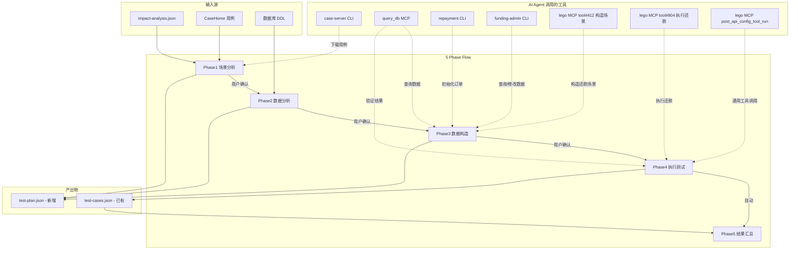

# 测试用例卡片 V2 迭代：5 阶段自测流程

> 版本: 1.0
> 日期: 2026-04-10
> 状态: 设计评审

## 概述

将测试用例卡片从单一"生成并执行"模式升级为 5 阶段交互式自测流程（场景分析 -> 数据分析 -> 数据构造 -> 执行测试 -> 结果汇总），通过 AI Agent + MCP 工具链驱动全流程，新增 test-plan.json 中间产物，支持 CaseHome 用例关联和数据库验证。

## 现状分析

当前 `TestCasesCard` 是纯展示组件，仅生成一个简单 Prompt 让 AI 一次性完成"生成测试用例 + 执行"，缺少：
- CaseHome 用例关联
- 测试数据的分析与构造
- 分阶段可控执行
- 数据库级别的结果验证

相关关键文件：
- UI: `webview-ui/src/components/kanban/cards/TestCasesCard.tsx`
- Prompt: `webview-ui/src/lib/prompt-generators.ts` (L603-628)
- Bridge: `extension/src/bridge/observatory-request-handler.ts`
- Types: `webview-ui/src/types/observatory.ts` (L414-444)
- 父容器: `webview-ui/src/components/kanban/RequirementDetail.tsx` (L660-700)

---

## 一、总体架构



---

## 二、新增数据模型 — test-plan.json

在 `specs/<feature>/observatory/test-plan.json` 存放阶段性中间产物（Phase 1-3），与已有 `test-cases.json`（Phase 4-5）形成上下游关系。

```typescript
interface TestPlan {
  schema_version: "1.0";
  created_at: string;
  workspace_branch: string;
  head_commit: string;
  source_impact_analysis_head_commit: string;
  current_phase: "scenario_analysis" | "data_analysis" | "data_preparation" | "ready";
  scenarios: TestPlanScenario[];
}

interface TestPlanScenario {
  id: string;                          // PLAN_001
  scenario_id: string;                 // SCENARIO_xxx from impact-analysis
  scenario_name: string;
  description: string;
  casehome_refs?: CaseHomeRef[];       // CaseHome 用例引用

  // Phase 2 enriched
  data_analysis?: {
    required_apis: { method: string; url: string; description: string }[];
    required_configs: { key: string; value: string; description: string }[];
    test_data_description: string;
    initial_state: Record<string, unknown>;
    expected_state: Record<string, unknown>;
    verification_queries: { description: string; sql: string; expected: Record<string, unknown> }[];
  };

  // Phase 3 enriched
  data_preparation?: {
    status: "pending" | "ready" | "failed";
    order_id?: string;
    preparation_log: string[];
    prepared_data: Record<string, unknown>;
  };
}

interface CaseHomeRef {
  case_id: number;
  title: string;
  category: string;
  local_path?: string;    // 本地 Markdown 文件路径
}
```

**文件变更**：
- 新增 `extension/src/observatory/schemas/test-plan.schema.json`
- 扩展 `webview-ui/src/types/observatory.ts` — 添加 `TestPlan`、`TestPlanScenario`、`CaseHomeRef` 等类型
- 扩展 `extension/src/observatory/schemas/test-cases.schema.json` — `TestCaseEntry` 新增可选字段 `plan_scenario_id`、`execution_tool`、`verification_results`

---

## 三、增强预检机制（Preflight）

在 `extension/src/observatory/preflight-resolver.ts` 中新增能力探测：

- **CaseHome CLI**：检测 `cli-anything-case-server` 是否可执行
- **repay-troubleshoot MCP**：检测 `user-repay-troubleshoot-mcp` 的 `query_db` 工具是否可用
- **funding-admin CLI**：检测 `cli-anything-funding-admin` 是否可执行
- **repayment CLI**：检测 `cli-anything-repayment` 是否可执行

探测结果注入 `PreflightResult` 并传递给 Prompt 模板变量：

```typescript
// 新增到 PreflightResult
toolStatus: {
  caseServer: ToolStatusEntry;     // CLI skill
  queryDb: ToolStatusEntry;        // MCP tool
  repayment: ToolStatusEntry;      // CLI skill
  fundingAdmin: ToolStatusEntry;   // CLI skill
  legoRun: ToolStatusEntry;        // MCP tool
};
```

---

## 四、4 个阶段 Prompt 生成器（核心设计）

在 `webview-ui/src/lib/prompt-generators.ts` 中新增 4 个函数，替代原来单一的 `generateTestCasesPrompt`。

### 4.0 Prompt 引导原则

AI 做场景分析和数据设计需要 3 类知识，Prompt 必须分层注入：

- **什么代码变了**：`impact-analysis.json` 场景列表 + `changed_files` 变更文件 + `@ai.doc` 注解
- **已有什么参考**：CaseHome 用例标题/详情 + Lego 平台已有自动化工具
- **数据长什么样**：数据库 DDL 表结构 + 测试环境实际数据（通过工具实时查）

每个阶段 Prompt 结构统一为：**静态上下文注入 + 工具使用指导 + 逐步方法论 + golden example + 输出 Schema**。

### 4.1 Phase 1: `generateTestPlanPhase1Prompt` — 场景分析

**静态上下文注入**：

| 注入变量 | 来源 | 说明 |
|---------|------|------|
| `{{impactScenarios}}` | `impact-analysis.json → scenarios` | 含 id/name/impact/description/related_files |
| `{{changedFiles}}` | `impact-analysis.json → changed_files` | AI 可按路径读取变更代码 |
| `{{caseHomeLocalDir}}` | 扩展扫描 `docs/domain/repay/caseHome/*.md` | 已下载的 CaseHome 用例目录 |
| `{{caseHomeFileList}}` | 目录下 `.md` 文件名列表 | AI 知道本地有哪些用例可读 |
| `{{caseServerStatus}}` | preflight 探测 | `available` / `missing` |
| `{{legoMcpStatus}}` | preflight 探测 | lego MCP 可用状态 |

**工具使用指导**（条件注入）：

```markdown
## 可用工具

{{#if caseServerAvailable}}
### CaseHome CLI（下载/更新用例）
如果本地用例目录为空或需要更新，请执行：
```bash
export CASE_SERVER_USERNAME="yijiang"
/Users/jiangyi/Documents/codedev/cli-everything/.venv/bin/cli-anything-case-server download "还款"
```
默认输出到：{{caseHomeLocalDir}}
可用分类：试算、还款、催收（用 list-categories 查看全部）
{{/if}}

{{#if legoMcpAvailable}}
### Lego MCP — 在线查询 CaseHome
- `get_api_mcp_getCaseDetail`：按 caseId 或标题模糊匹配查询用例详情
- `get_api_mcp_searchTools`：搜索 Lego 平台已有的自动化测试工具
{{/if}}
```

**逐步方法论**：

```markdown
## 执行步骤

### 第一步：读取影响场景
以下场景来自影响分析（共 {{totalScenarios}} 个）：
{{impactScenarios}}

### 第二步：关联 CaseHome 已有用例
{{#if caseHomeFileList}}
本地已下载的用例文件：
{{caseHomeFileList}}
请读取这些 .md 文件，提取用例标题和关键测试步骤。
{{else}}
本地无 CaseHome 用例。{{#if caseServerAvailable}}请先用 case-server CLI 下载。{{/if}}
{{/if}}
{{#if legoMcpAvailable}}
还可用 `get_api_mcp_getCaseDetail` 按标题在线查询用例详情补充。
{{/if}}

### 第三步：逐场景分析
对每个影响场景：
1. 阅读 `related_files` 中的变更代码，理解涉及的业务逻辑
2. 匹配 CaseHome 中相关的已有用例（按场景名/关键词匹配）
3. 判断是否有 CaseHome 未覆盖的新场景（需新增测试）
4. 用 `get_api_mcp_searchTools` 搜索 Lego 是否已有对应自动化工具
5. 为每个场景写清楚：测试什么、为什么要测、预期行为是什么
```

**golden example**（还款域）：

```json
{
  "schema_version": "1.0",
  "current_phase": "scenario_analysis",
  "scenarios": [
    {
      "id": "PLAN_001",
      "scenario_id": "SCENARIO_001",
      "scenario_name": "提前还款当期",
      "description": "用户对当期未逾期账单执行提前还款，验证试算金额正确、还款流程成功、账单状态正确变更",
      "casehome_refs": [
        { "case_id": 14814, "title": "提前还当期-正常流程", "category": "还款" },
        { "case_id": 14815, "title": "提前还当期-已逾期", "category": "还款" }
      ]
    },
    {
      "id": "PLAN_002",
      "scenario_id": "SCENARIO_002",
      "scenario_name": "提前结清",
      "description": "用户一次性还清所有剩余账单，验证减免金额计算、全部账单状态变更、订单结清",
      "casehome_refs": [
        { "case_id": 14820, "title": "提前结清-正常", "category": "还款" }
      ]
    }
  ]
}
```

---

### 4.2 Phase 2: `generateTestPlanPhase2Prompt` — 数据分析

**静态上下文注入**：

| 注入变量 | 来源 | 说明 |
|---------|------|------|
| `{{testPlanScenarios}}` | `test-plan.json → scenarios` (Phase 1 确认后) | 已确认的场景列表含 CaseHome 关联 |
| `{{ddlPath}}` | 配置项 `observatory.test.ddlPath` 或默认 | DDL 文件路径，AI 可读取 |
| `{{ddlCoreTables}}` | 扩展预提取 DDL 中匹配 changed_files 的表 | 核心表名列表（不全量注入 DDL，防 prompt 过长） |
| `{{queryDbStatus}}` | preflight 探测 | `user-repay-troubleshoot-mcp` 的 `query_db` 可用状态 |
| `{{queryConfigStatus}}` | preflight 探测 | `query_config` 可用状态 |

**DDL 注入策略**（按需裁剪，不全量）：

```markdown
## 数据库上下文

以下是与本次变更相关的核心表（从 DDL 提取）：
{{ddlCoreTables}}

完整 DDL 文件路径：{{ddlPath}}
如需查看某张表的完整字段定义，请读取该文件中对应的 CREATE TABLE 语句。

{{#if queryDbAvailable}}
还可用 `query_db` MCP（env=test, database=loan）查询测试环境中的实际数据结构和样本。
{{/if}}
{{#if queryConfigAvailable}}
可用 `query_config` MCP 查询配置中心当前值（如还款开关、限额等）。
{{/if}}
```

**逐步方法论**：

```markdown
## 逐场景数据分析

对 test-plan.json 中的每个场景，请完成以下 4 项分析：

### A. 分析调用链路
1. 从变更代码出发，追踪该场景的 API 调用链（Controller → Service → DAO）
2. 记录每个接口的 method、url、关键入参
3. 如果 CaseHome 用例中记录了接口信息，优先参考

### B. 分析数据需求
1. 读取 DDL 中相关表的字段定义（路径：{{ddlPath}}）
2. 描述执行前需要什么样的数据状态（initial_state）
   - 用 `表名.字段名 = 值` 格式，清楚标注每个条件
3. 描述执行后的预期数据状态（expected_state）
   - 重点关注状态字段、金额字段、时间字段的变化

### C. 生成验证 SQL
针对 expected_state，为每个检查点生成一条 SELECT 语句：
- 必须包含 WHERE order_id = '{order_id}'（占位符，Phase 3 替换）
- 明确要查哪些字段、期望值是什么
- 用注释说明每条 SQL 的检查目的
{{#if queryDbAvailable}}
这些 SQL 将在 Phase 4 通过 `query_db` MCP（env=test, database=loan）自动执行。
{{/if}}

### D. 标注配置依赖
如果场景需要特定配置开关才能走通，记录：
- 配置 key（groupName + configName）
- 所需值
{{#if queryConfigAvailable}}
可用 `query_config` MCP 查询当前配置值确认。
{{/if}}
```

**golden example**（还款域）：

```json
{
  "id": "PLAN_001",
  "scenario_id": "SCENARIO_001",
  "scenario_name": "提前还款当期",
  "data_analysis": {
    "required_apis": [
      { "method": "GET", "url": "/api/repay/listFundingReadyToPay", "description": "获取可还款账单列表" },
      { "method": "GET", "url": "/api/repay/singleRepayTrial", "description": "单期还款试算，返回金额明细" },
      { "method": "POST", "url": "/api/repay/repayV2", "description": "发起还款请求" }
    ],
    "required_configs": [
      { "key": "repay.advance.enabled", "value": "true", "description": "提前还款总开关" }
    ],
    "test_data_description": "一笔未结清订单，当期为第3期(UNPAID)，未逾期，有绑定银行卡，支持提前还款",
    "initial_state": {
      "cash_loan_order.status": "ACTIVE",
      "cash_loan_order.can_settle_in_advance": true,
      "cash_loan_instalment[period=3].status": "UNPAID",
      "cash_loan_instalment[period=3].overdue_days": 0
    },
    "expected_state": {
      "cash_loan_instalment[period=3].status": "PAID",
      "repay_record.status": "SUCCESS",
      "repay_record.repay_type": "SINGLE_REPAY",
      "payment_record.status": "SUCCESS",
      "repay_record.total_amount == payment_record.amount": true
    },
    "verification_queries": [
      {
        "description": "验证当期账单状态变为已还",
        "sql": "SELECT status FROM cash_loan_instalment WHERE order_id = '{order_id}' AND period = 3",
        "expected": { "status": "PAID" }
      },
      {
        "description": "验证还款记录创建且成功",
        "sql": "SELECT status, total_amount, repay_type FROM repay_record WHERE order_id = '{order_id}' ORDER BY id DESC LIMIT 1",
        "expected": { "status": "SUCCESS", "repay_type": "SINGLE_REPAY" }
      },
      {
        "description": "验证支付金额与还款金额一致",
        "sql": "SELECT pr.total_amount as repay_amt, pay.amount as pay_amt FROM repay_record pr JOIN payment_record pay ON pay.repay_record_id = pr.id WHERE pr.order_id = '{order_id}' ORDER BY pr.id DESC LIMIT 1",
        "expected": { "repay_amt == pay_amt": true }
      },
      {
        "description": "验证支付渠道正确",
        "sql": "SELECT channel FROM payment_record WHERE repay_record_id = (SELECT id FROM repay_record WHERE order_id = '{order_id}' ORDER BY id DESC LIMIT 1)",
        "expected": { "channel": "BANK_CARD" }
      }
    ]
  }
}
```

---

### 4.3 Phase 3: `generateTestPlanPhase3Prompt` — 数据构造

**静态上下文注入**：

| 注入变量 | 来源 | 说明 |
|---------|------|------|
| `{{testPlanWithAnalysis}}` | `test-plan.json`（Phase 2 确认后） | 含 data_analysis 的完整场景列表 |
| `{{queryDbStatus}}` | preflight | `query_db` MCP 可用状态 |
| `{{repaymentCliStatus}}` | preflight | repayment CLI 可用状态 |
| `{{fundingAdminCliStatus}}` | preflight | funding-admin CLI 可用状态 |
| `{{legoMcpStatus}}` | preflight | lego MCP 可用状态 |

**工具使用指导**：

```markdown
## 可用工具

### 1. 查询测试数据 — query_db MCP
工具：user-repay-troubleshoot-mcp / query_db
参数：database="loan", env="test", sql="SELECT ..."
用途：在测试环境搜索符合条件的订单

### 2. 构造还款场景 — Lego MCP tool#412
工具：user-lego / post_api_config_tool_run
参数：{ "id": 412, "inputParams": { "order_id": "xxx", "order_scene": "REPURCHASE", "customized_time": "2024-04-01 23:59:59" } }
order_scene 可选值：REPURCHASE（回购）、ORDER_DEFAULT_SCENE（默认）等

### 3. 查询/修改订单数据 — funding-admin CLI
查询：cli-anything-funding-admin db query LOAN "SELECT * FROM cash_loan_order WHERE id=xxx"
修改（仅测试环境）：cli-anything-funding-admin --test-env db update LOAN "UPDATE ... WHERE id=xxx"

### 4. 查询订单还款信息 — repayment CLI
cli-anything-repayment --json info ORDER_ID
```

**还款域 Lego 工具映射表**：

| 用途 | Lego Tool ID | MCP 调用方式 | inputParams |
|------|-------------|-------------|-------------|
| 构造订单还款场景 | **412** | `post_api_config_tool_run { id: 412, inputParams: {...} }` | `order_id`, `order_scene`(如 REPURCHASE), `customized_time` |
| 执行还款 | **804** | `post_api_config_tool_run { id: 804, inputParams: {...} }` | `order_id`, `repay_scenario`(如 ORDER_DEFAULT_SCENE), `is_mock`, `is_settle` |

**逐步方法论**：

```markdown
## 逐场景构造数据

对每个场景的 `data_analysis.initial_state`，执行以下步骤：

### Step 1：搜索候选订单
根据 initial_state 的条件，用 query_db 搜索测试环境中符合条件的订单：
- 例如："SELECT id, status FROM cash_loan_order WHERE status='ACTIVE' AND can_settle_in_advance=1 LIMIT 10"
- 找到后记录 order_id

### Step 2：校验订单状态
用 query_db 或 repayment CLI 查看订单的详细状态，确认满足 initial_state 的所有条件。
不满足时：
- 能用 Lego tool#412 构造场景的，优先用 tool#412
- 需要直接改数据的，用 funding-admin CLI（仅测试环境）

### Step 3：初始化场景
调用 Lego tool#412 构造对应还款场景，确保订单进入可测试状态。

### Step 4：再次校验
构造完成后再次用 query_db 查询，确认当前状态与 initial_state 一致。

### Step 5：记录到 test-plan.json
更新每个场景的 `data_preparation`：
- status: "ready"（成功）/ "failed"（失败）
- order_id: 实际使用的订单 ID
- preparation_log: 执行过的每一步操作记录
- prepared_data: 当前实际数据快照
```

**golden example**：

```json
{
  "data_preparation": {
    "status": "ready",
    "order_id": "LkpWVYfO",
    "preparation_log": [
      "query_db: SELECT id FROM cash_loan_order WHERE status='ACTIVE' LIMIT 5 → found LkpWVYfO",
      "repayment info LkpWVYfO → 4 unpaid instalments, period 3 current due",
      "lego tool#412: order_id=LkpWVYfO, order_scene=REPURCHASE → OK",
      "query_db: verified instalment[3].status=UNPAID, overdue_days=0"
    ],
    "prepared_data": {
      "order_id": "LkpWVYfO",
      "current_period": 3,
      "instalment_status": "UNPAID",
      "total_owed": 714.08
    }
  }
}
```

---

### 4.4 Phase 4: `generateTestExecutionPrompt` — 执行测试

**静态上下文注入**：

| 注入变量 | 来源 | 说明 |
|---------|------|------|
| `{{readyScenarios}}` | `test-plan.json` 中 `data_preparation.status="ready"` 的场景 | 只执行已准备好数据的场景 |
| `{{legoMcpStatus}}` | preflight | lego MCP 可用状态 |
| `{{queryDbStatus}}` | preflight | query_db 可用状态 |

**工具使用指导**：

```markdown
## 执行工具

### 执行还款 — Lego MCP tool#804
工具：user-lego / post_api_config_tool_run
参数：{ "id": 804, "inputParams": { "order_id": "xxx", "repay_scenario": "ORDER_DEFAULT_SCENE", "is_mock": "true", "is_settle": "false" } }
- repay_scenario: ORDER_DEFAULT_SCENE（当期还款）、SETTLE_IN_ADVANCE（提前结清）等
- is_mock: "true"=模拟支付（测试环境推荐）、"false"=真实支付
- is_settle: "true"=提前结清、"false"=单期还款

### 执行 Lego 平台已有用例
工具：user-lego / post_api_testcase_run
参数：{ "id": <testcase_id>, "inputParams": { ... }, "source": 2 }

### 验证结果 — query_db MCP
用 Phase 2 中定义的 verification_queries，替换 {order_id} 为实际值后逐条执行。
```

**逐步方法论**：

```markdown
## 逐场景执行

对每个 status="ready" 的场景：

### Step 1：执行业务操作
根据场景类型调用对应工具：
- 当期还款 → Lego tool#804, repay_scenario=ORDER_DEFAULT_SCENE, is_settle=false
- 提前结清 → Lego tool#804, repay_scenario=SETTLE_IN_ADVANCE, is_settle=true
- 其他场景 → 按 data_analysis.required_apis 的接口链路调用

### Step 2：等待异步处理
还款可能是异步的，执行后等待 5-10 秒再验证。

### Step 3：逐条执行验证 SQL
将 data_analysis.verification_queries 中的 {order_id} 替换为实际值，
通过 query_db（env=test, database=loan）逐条执行。

### Step 4：对比结果
每条 SQL 的 actual 结果与 expected 逐字段比较：
- 全部匹配 → status: "passed"
- 任一不匹配 → status: "failed"，记录 error_message（包含 expected vs actual 差异）

### Step 5：写入 test-cases.json
```

**golden example**：

```json
{
  "cases": [
    {
      "id": "TC_001",
      "scenario_id": "SCENARIO_001",
      "scenario_name": "提前还款当期",
      "plan_scenario_id": "PLAN_001",
      "description": "对订单 LkpWVYfO 执行当期还款",
      "execution_tool": "lego_tool#804",
      "request": {
        "tool": "post_api_config_tool_run",
        "params": { "id": 804, "inputParams": { "order_id": "LkpWVYfO", "repay_scenario": "ORDER_DEFAULT_SCENE", "is_mock": "true", "is_settle": "false" } }
      },
      "expected": {
        "instalment_status": "PAID",
        "repay_record_status": "SUCCESS",
        "payment_matches_repay": true
      },
      "actual": {
        "instalment_status": "PAID",
        "repay_record_status": "SUCCESS",
        "payment_matches_repay": true
      },
      "verification_results": [
        { "description": "账单状态", "sql": "SELECT status FROM cash_loan_instalment WHERE order_id='LkpWVYfO' AND period=3", "expected": {"status":"PAID"}, "actual": {"status":"PAID"}, "match": true },
        { "description": "还款记录", "sql": "SELECT status FROM repay_record WHERE order_id='LkpWVYfO' ORDER BY id DESC LIMIT 1", "expected": {"status":"SUCCESS"}, "actual": {"status":"SUCCESS"}, "match": true },
        { "description": "金额一致", "sql": "SELECT pr.total_amount=pay.amount as eq FROM repay_record pr JOIN payment_record pay ON pay.repay_record_id=pr.id WHERE pr.order_id='LkpWVYfO' ORDER BY pr.id DESC LIMIT 1", "expected": {"eq":1}, "actual": {"eq":1}, "match": true }
      ],
      "status": "passed"
    }
  ]
}
```

**还款域典型验证项**（作为 Prompt 检查清单注入）：
- 账单表 `cash_loan_instalment.status` = PAID
- 还款记录 `repay_record.status` = SUCCESS
- 支付记录 `payment_record.status` = SUCCESS
- 还款金额 = 支付金额（`repay_record.total_amount == payment_record.amount`）
- 还款总金额 = 入账总金额
- 支付渠道与前端调用方式一致

---

### 4.5 Prompt 引导设计要点总结

3 个核心设计决策保证 AI 产出质量：

- **给具体知识而非抽象指令**：注入 DDL 表结构、CaseHome 用例标题、Lego 工具参数模板，让 AI 基于实际数据写方案，而非凭空推测
- **用 golden example 锚定输出精度**：每个阶段末尾附带还款域的完整示例 JSON，AI 模仿示例的字段粒度和内容深度来填写其他场景
- **工具辅助弥补知识盲区**：静态注入覆盖不到的信息（当前配置值、测试环境实际数据、在线 CaseHome 详情），通过 `query_db` + `query_config` + `get_api_mcp_getCaseDetail` 让 AI 实时查询

---

## 五、UI 改造

### 5.1 TestCasesCard 升级

将 `TestCasesCard.tsx` 从纯展示升级为阶段感知组件：

```
+------------------------------------------------------+
| 测试用例                                               |
| Phase: [1.场景分析] [2.数据分析] [3.数据构造] [4.执行] [5.结果] |
|        ^^^^^^^^^^                                      |
| 场景: 12 | CaseHome关联: 8 | 待验证: 12                 |
|                                                        |
| MCP: testRunner 已配置 | query_db 已配置                |
| Skill: case-server 可用 | repayment 可用               |
|                                                        |
| [分析场景]  [查看计划]                                    |
+------------------------------------------------------+
```

阶段指示器根据 `test-plan.json` 的 `current_phase` 和 `test-cases.json` 是否存在来高亮当前阶段。每个阶段对应不同的按钮组：

- Phase 1: `[分析场景]`
- Phase 2: `[分析数据]`
- Phase 3: `[构造数据]`
- Phase 4: `[执行测试]` `[重跑失败]` `[继续执行]`
- Phase 5: `[查看详情]`（自动进入）

### 5.2 新增阶段指示器组件

新建 `webview-ui/src/components/kanban/cards/TestPhaseIndicator.tsx`：
- 5 个圆点/步骤条
- 当前阶段高亮，已完成阶段打勾
- 点击已完成阶段可回看该阶段产物

### 5.3 Props 扩展

```typescript
type Props = {
  tests: TestCasesResult | null;
  testPlan: TestPlan | null;          // 新增
  freshness: DataFreshness;
  preflight: PreflightResult | null;
  // 4 phase callbacks (替代原来单一 onGeneratePrompt)
  onPhase1: () => void;               // 场景分析
  onPhase2: () => void;               // 数据分析
  onPhase3: () => void;               // 数据构造
  onPhase4: () => void;               // 执行测试
  onRerunFailed: () => void;
  onContinuePending: () => void;
  onViewPlan: () => void;             // 新增：查看 test-plan
  onViewDetail: () => void;
};
```

---

## 六、Bridge 与存储层扩展

### 6.1 新增 Bridge 方法

在 `observatory-request-handler.ts` 的 `dispatch` 中新增：

- `getTestPlan` — 读取 `test-plan.json`
- `saveTestPlan` — 校验并保存 `test-plan.json`（含 schema 校验 + 阶段状态机校验）
- `getTestPlanMd` — 读取扩展派生的 `test-plan.md`

### 6.2 新增 API 端点

在 `local-server.ts` 中新增：

- `GET /api/observatory/test-plan`
- `PUT /api/observatory/test-plan`
- `GET /api/observatory/test-plan-md`

### 6.3 Validation Pipeline

在 `validation-pipeline.ts` 中新增 `processTestPlan` 函数：
- AJV schema 校验
- 阶段状态机校验（phase 只能向前推进或保持）
- Git 状态注入
- 派生 `test-plan.md` 渲染

---

## 七、Store 层扩展

在 `webview-ui/src/store/observatory-store.ts` 中：
- 新增 `testPlan: TestPlan | null` 状态
- `loadRequirementPanel` 中并行加载 `getTestPlan`
- 新增 `testPlanPhase` 计算属性

---

## 八、Prompt 模板支持

在 Prompt 模板优先级机制中（`observatory.prompt.templateDir`），新增 4 个可覆盖的模板文件名：

- `test-case-phase1.md` — 场景分析
- `test-case-phase2.md` — 数据分析
- `test-case-phase3.md` — 数据构造
- `test-case-phase4.md` — 执行测试

还款域默认模板作为内置兜底，放在 `prompt-generators.ts` 中。

---

## 九、验证策略

### 9.1 开发阶段 — 单测覆盖

| 测试文件 | 覆盖内容 |
|---------|---------|
| `validation-pipeline.test-plan.test.ts` | processTestPlan 三阶段 fixture 校验、阶段状态机（不能跳阶段）、语义校验（scenario_id 引用） |
| `preflight-resolver.test.ts`（扩展已有） | 新增 caseServer/queryDb/repayment/fundingAdmin 探测 case |

遵循已有 vitest 模式，内联小对象作为 fixture。

### 9.2 使用阶段 — 运行时守护

- **阶段门禁**：UI 按钮 disabled 直到前置阶段产物存在且校验通过
- **保存时三层校验**（AJV Schema -> summary 重算 -> 语义校验），失败阻止进入下一阶段
- **Prompt 内嵌 Schema + golden example**：防止 AI 输出格式偏移
- **Phase 4 结果双重校验**：扩展侧检查 `verification_results.match` 与 `status` 一致性，`execution_tool` 非空
- **人工确认点**：Phase 1 结果展示预览，用户确认后才进入 Phase 2

### 9.3 端到端 Smoke Test（开发完成后手动验证）

使用已知还款场景（如 order_id=LkpWVYfO 当期还款）完整跑 5 阶段，与手动执行结果对比。

---

## 十、实现分期

### Phase A — 数据模型与基础设施

1. 定义 `TestPlan` 类型和 JSON Schema
2. `processTestPlan` 校验管线（含阶段状态机）
3. Bridge 方法 + API 端点
4. 扩展 `PreflightResult` 增加工具探测
5. **单测**：processTestPlan fixture 校验 + 状态机 + 语义

### Phase B — Prompt 生成器

6. 4 个阶段的 Prompt 生成函数（含 Schema + golden example）
7. 还款域特定模板内容（Lego tool#412/804 映射表）
8. 注入变量：CaseHome 状态、query_db 状态、CLI 工具状态

### Phase C — UI 改造

9. `TestPhaseIndicator` 组件
10. `TestCasesCard` 升级为多阶段（含阶段门禁 disabled 逻辑）
11. `RequirementDetail` 集成新阶段 callbacks + 确认预览
12. Store 扩展（testPlan 状态）

### Phase D — 打磨与验证

13. 新鲜度校验（test-plan 与 impact-analysis 绑定）
14. `test-plan.md` 渲染模板
15. Phase 4 结果双重校验（verification_results.match 与 status 一致性）
16. 端到端 Smoke Test
17. 更新 REQUIREMENT_PANEL_V2_DESIGN.md
